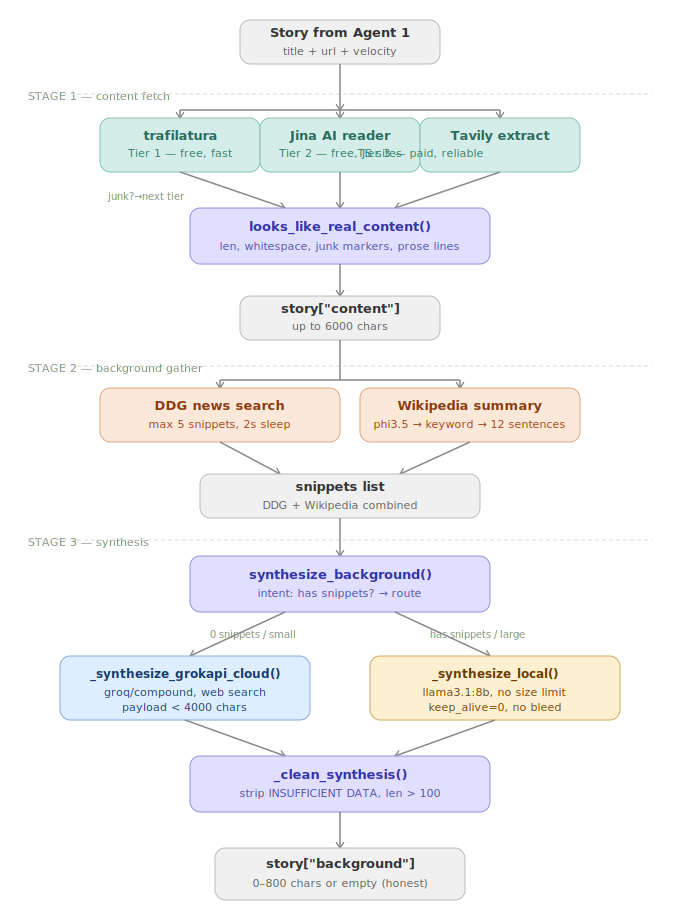
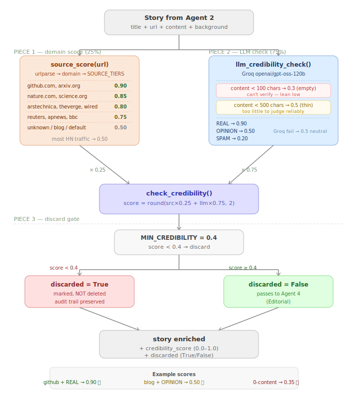

# 🎙️ AI Newsroom Studio

<div align="center">


**A fully autonomous, multi-agent AI pipeline that researches trending tech news, fact-checks it, writes engaging scripts, generates short-form videos, and publishes them to YouTube — all without human intervention.**

[Overview](#-overview) • [What's Built](#-whats-built-so-far) • [Architecture](#-agent-architecture) • [Tech Stack](#-tech-stack) • [Setup](#-getting-started) • [Roadmap](#-development-roadmap)

</div>

---

## 📌 Overview

AI Newsroom Studio is a production-grade multi-agent system that mirrors how a real newsroom operates — except every role is played by a specialized AI agent. From trend discovery to YouTube upload, the entire pipeline runs autonomously on a daily schedule.

The system identifies the most buzzworthy topics from HackerNews, enriches them with article content and background context, fact-checks credibility, selects the top stories editorially, writes a compelling script, generates a short-form video, and publishes it — all in one unattended pipeline run.

### Why This Project?

- **Real-world multi-agent orchestration** — not a toy demo, built line by line
- **Edge AI + Cloud hybrid** — local Ollama models for dev, cloud APIs for production precision
- **Honest engineering** — every design decision is documented, including what failed and why
- **Short-form first** — targets YouTube Shorts (60–90 sec) for algorithmic reach

---

## ✅ What's Built So Far

| Agent | Status | Description |
|-------|--------|-------------|
| **Agent 1 — Trend Hunter** | ✅ Complete | HackerNews top stories with velocity scoring |
| **Agent 2 — Context Researcher** | ✅ Complete | 3-tier content fetch + background synthesis |
| **Agent 3 — Fact Checker** | ✅ Complete | Domain credibility + Groq 120B classification |
| Agent 4 — Editorial | 🔨 Next | Pick top 3, diversity, rank by background quality |
| Agent 5 — Script Writer | ⏳ Planned | Hook → Context → Twist → CTA |
| Agent 6 — Script QC | ⏳ Planned | APPROVE/REVISE loop, max 2 iterations |
| Agent 7 — Video Prompt | ⏳ Planned | Scene-by-scene cinematic prompts |
| Agent 8 — Video Generator | ⏳ Planned | MOCK ffmpeg first, Fal.ai Wan later |
| Agent 9 — SEO Optimizer | ⏳ Planned | Title, description, tags |
| Agent 10 — Publisher | ⏳ Planned | YouTube Data API v3 |

---

## 🏗️ Agent Architecture

### Pipeline Overview

```
HackerNews API
     │
     ▼
┌─────────────────┐
│  Agent 1        │  velocity = (upvotes + comments×2) / age_hrs
│  Trend Hunter   │  → top 8 stories sorted by velocity
└────────┬────────┘
         │  title + url + velocity
         ▼
┌─────────────────┐
│  Agent 2        │  3-tier content fetch → background synthesis
│  Context        │  → story["content"] + story["background"]
│  Researcher     │
└────────┬────────┘
         │  content + background
         ▼
┌─────────────────┐
│  Agent 3        │  source_score (25%) + LLM credibility (75%)
│  Fact Checker   │  → story["credibility_score"] + story["discarded"]
└────────┬────────┘
         │
    ┌────┴─────┐
    ▼           ▼
[DISCARD]   [KEEP]
score<0.4   score≥0.4
         │
         ▼
    Agent 4 → ... → Agent 10
    (in progress)
```

### Agent 2 — Context Researcher (detailed)

Agent 2 is the most complex agent built so far. It runs three internal stages for every story.




```
STAGE 1 — Content Fetch (3-tier fallback)
  trafilatura → Jina AI reader → Tavily extract
  Each tier gated by looks_like_real_content():
    ✓ length check (≥200 chars)
    ✓ whitespace ratio check
    ✓ junk markers (Cloudflare, Akamai, captcha...)
    ✓ prose-line check (menus vs articles)

STAGE 2 — Background Gather
  DDG news search (up to 5 snippets, 2s rate-limit sleep)
  + Wikipedia summary (phi3.5 extracts keyword → 12 sentences)
  → combined snippets list

STAGE 3 — Synthesis (intent-based routing)
  0 snippets + small payload  → groq/compound (web search built-in)
  rich snippets OR large payload → llama3.1:8b local (no size limit)
  Either path → _clean_synthesis() → story["background"]
```

### Agent 3 — Fact Checker (detailed)



```
source_score(url)              25% weight
  Domain trust map (HN-tuned):
    github.com, arxiv.org → 0.9
    nature.com, science.org → 0.85
    arstechnica.com, theverge.com, wired.com → 0.8
    reuters.com, bbc.com, apnews.com → 0.75
    unknown blogs → 0.5 (most HN traffic)

llm_credibility_check()        75% weight
  Groq gpt-oss-120b classifies article as:
    REAL    → 0.9  (genuine product/tech/event)
    OPINION → 0.5  (essay, rant — legitimate but not news)
    SPAM    → 0.2  (scam/clickbait/misinformation)
  Guards:
    empty content (<100 chars) → 0.3
    thin content (<500 chars)  → 0.5 neutral
    Groq failure               → 0.5 neutral (never discard on crash)

combined = round(src×0.25 + llm×0.75, 2)
score < 0.4 → story["discarded"] = True  (marked, NOT deleted)
```

---

## 🛠️ Tech Stack

### LLM Routing (Dev vs Production)

| Stage | Dev (local) | Production (one dict change) |
|-------|-------------|------------------------------|
| Wiki keyword extraction | phi3.5 (3.8B, Ollama) | same |
| Background synthesis | llama3.1:8b (Ollama) | gemini-2.0-flash |
| Compound search synthesis | groq/compound | groq/compound |
| Credibility classification | Groq gpt-oss-120b | Groq gpt-oss-120b |

### Data Sources

| Source | What | Cost |
|--------|------|------|
| HackerNews Firebase API | Top stories + engagement | Free, no key |
| DuckDuckGo News (DDGS) | Background snippets | Free, no key |
| Wikipedia (python lib) | Background summaries | Free, no key |
| Jina AI reader | JS-heavy page content | Free tier |
| Tavily Extract | Paywalled/blocked content | Free tier |
| Groq Cloud | 120B credibility + compound synthesis | Free tier (1000/day) |

### Models in Use

| Model | Size | Where | Job |
|-------|------|--------|-----|
| phi3.5 | 3.8B | Ollama local | Wikipedia keyword extraction |
| llama3.1:8b | 8B | Ollama local | Background synthesis (primary) |
| groq/compound | cloud | Groq | Synthesis for 0-snippet stories (web search) |
| openai/gpt-oss-120b | 120B | Groq | Credibility classification |

---

## 📁 Project Structure

```
NewsStudio/
├── experiments/
│   ├── agents/
│   │   ├── __init__.py
│   │   ├── agent1.py          # Trend Hunter — HackerNews + velocity
│   │   ├── agent2.py          # Context Researcher — fetch + background
│   │   └── agent3.py          # Fact Checker — credibility scoring
│   │
│   ├── workflow.ipynb          # Main pipeline notebook (A1→A2→A3)
│   └── __init__.py
│
├── KNOWN_ISSUES.md             # Documented limitations (not bugs)
├── .gitignore
├── LICENSE
└── README.md
```

---

## 🚀 Getting Started

### Prerequisites

- Python 3.13+
- [Ollama](https://ollama.ai) installed and running
- Groq API key (free at console.groq.com)
- Tavily API key (free tier)

### Installation

```bash
# 1. Clone the repo
git clone https://github.com/AlgoDr/AI-Newsroom-Studio.git
cd AI-Newsroom-Studio

# 2. Create virtual environment
python -m venv multi-agent-env
source multi-agent-env/bin/activate

# 3. Install dependencies
pip install trafilatura requests ddgs wikipedia \
            ollama groq tavily-python langchain-core \
            typing_extensions

# 4. Pull local models
ollama pull phi3.5
ollama pull llama3.1:8b

# 5. Set up environment variables
cp .env.example .env   # then fill in your keys
```

### Environment Variables

```env
GROQ_KEY=your_groq_api_key
TAVILY_API_KEY=your_tavily_api_key
```

### Run the Pipeline

Open `experiments/workflow.ipynb` in Jupyter and run cells top to bottom:

```
Cell [02] — NewsroomState setup
Cell [04] — Agent 1 node definition
Cell [05] — Run Agent 1 (fetch 8 HN stories)
Cell [07] — Ollama health check
Cell [08] — Agent 2 node definition
Cell [09] — Run Agent 2 (content + background)
Cell [10] — Inspect Agent 2 output
Cell [12] — Unit tests (Agent 2 pure functions)
Cell [14] — Agent 3 import
Cell [15] — Agent 3 node definition
Cell [16] — Full run: Agent 1 → 2 → 3
Cell [17] — Inspect all 3 agents output
```

### Expected Output (Agents 1-3)

```
Stories fetched: 8
  157.2 vel | age-verification-is-just-a-precursor...
  125.5 vel | pollen-ceo-negus-fancey-cto-wright...
  ...

Agent 2 Starts For : glm-5-2-beats-claude-in-our-benchmarks
Trafiltura Success ✅  In Loading Content: 10217 characters
  [synth] 6 snippets → llama3.1:8b
  [bg] background: 700 chars
...

── CREDIBILITY RESULTS ──────────────────────────
  [cred] GLM 5.2 beats Claude → 'REAL' → 0.9
0.80 ✅ KEEP | GLM 5.2 beats Claude in our benchmarks
0.35 🗑️ DISCARD | We found a bug in the hyper HTTP library
─────────────────────────────────────────────────
```

---

## 🗺️ Development Roadmap

### Phase 1 — Foundations ✅
- [x] LangGraph StateGraph, nodes, conditional edges
- [x] Shared NewsroomState TypedDict
- [x] HackerNews trend fetching with velocity scoring

### Phase 2 — Context Researcher (Agent 2) ✅
- [x] 3-tier content fetching (trafilatura → Jina → Tavily)
- [x] Junk content detection (looks_like_real_content)
- [x] DDG news background search
- [x] Wikipedia keyword extraction (phi3.5)
- [x] Content-anchored background synthesis
- [x] Intent-based synthesis routing (compound vs 8B)
- [x] Context bleed prevention (keep_alive=0)

### Phase 3 — Fact Checker (Agent 3) ✅
- [x] HN-tuned domain SOURCE_TIERS map
- [x] REAL/OPINION/SPAM classification (Groq gpt-oss-120b)
- [x] Combined credibility score (25/75 src/llm)
- [x] Soft discard marking (audit trail, not deletion)
- [x] Defensive guards (empty, thin, crash → neutral)

### Phase 4 — Editorial Agent 🔨 Next
- [ ] Composite score: credibility × velocity × has_background
- [ ] Pick top 3 with topic diversity
- [ ] Rank content+background stories higher (KNOWN_ISSUES ISSUE-1)
- [ ] Conditional discard edge (LangGraph router)

### Phase 5 — Script Writer
- [ ] Hook (3s) → Context → Twist → CTA structure
- [ ] 150-200 words for 60-90 sec video
- [ ] llama3.2:3b local / gemini-2.0-flash production

### Phase 6-10 — Video Pipeline
- [ ] Script QC (APPROVE/REVISE loop)
- [ ] Video Prompt Agent (cinematic scene descriptions)
- [ ] Video Generator (MOCK ffmpeg → Fal.ai Wan 2.2)
- [ ] SEO Optimizer
- [ ] YouTube Publisher

---

## 🧠 Key Design Decisions

### Why HackerNews over Reddit/NewsAPI?

HackerNews has a public Firebase API with zero authentication, real-time engagement data, and a high-quality tech audience. The velocity score `(upvotes + comments×2) / age_hrs` naturally surfaces breaking stories without requiring API keys or rate-limit management.

### Why local models + cloud hybrid?

Local Ollama models (phi3.5, llama3.1:8b) handle the high-frequency, low-precision tasks (keyword extraction, synthesis from given material). Cloud models (Groq gpt-oss-120b) handle the low-frequency, high-precision tasks (credibility judgment requiring world knowledge). This minimizes API costs while maximizing quality where it matters.

### Why REAL/OPINION/SPAM instead of a decimal?

Small models (3B) cannot reliably produce consistent decimal credibility scores — they return 0.2 for factual articles and 0.8 for hype without discrimination. Classification into 3 categories is what 3B+ models actually do well. The decimal score is computed in code from the label, not by the model.

### Why soft discard (mark, not delete)?

A story marked `discarded=True` stays in the pipeline state as an audit trail. Agent 4 (Editorial) can see WHY it was discarded, future debugging can inspect it, and the threshold can be tuned without rerunning the pipeline.

### Why not CrewAI?

LangGraph gives explicit control over every state transition. For a learning project, understanding every line is the goal — abstractions hide the interesting parts.

---

## 📊 Known Limitations

See [KNOWN_ISSUES.md](./KNOWN_ISSUES.md) for documented limitations including:

- **ISSUE-1:** GitHub/arXiv/docs URLs produce empty backgrounds (by design)
- **ISSUE-2:** Wikipedia keyword extraction occasionally off-target
- **ISSUE-3:** Local 3B model precision ceiling (resolved by cloud swap)
- **ISSUE-4:** llama3.1:8b context bleed (fixed with keep_alive=0)

---

## 🤝 Contributing

This project is actively being built as a learning exercise in production multi-agent systems. Contributions, suggestions, and issue reports are welcome.

---

## 📄 License

MIT License — see [LICENSE](./LICENSE) for details.

---

<div align="center">

Built with 🧠 by [Deepak Rathore](https://github.com/AlgoDr)

*From edge AI to autonomous AI newsrooms — one agent at a time.*

</div>