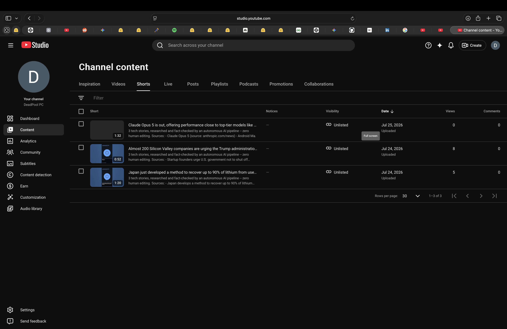

# AI Newsroom Studio

<div align="center">


**A fully autonomous, multi-agent AI pipeline that researches trending tech news, fact-checks it, writes engaging scripts, generates voice-over audio, assembles short-form videos, and publishes them to YouTube (unlisted, pending manual review) -- all without human intervention.**

[Overview](#overview) - [What's Built](#whats-built-so-far) - [Architecture](#agent-architecture) - [Tech Stack](#tech-stack) - [Setup](#getting-started) - [Roadmap](#development-roadmap) - [Automation](#automation--scheduling)


🔊 **[Listen to real generated voice-over samples](https://algodr.github.io/AI-Newsroom-Studio/audio-showcase.html)** &nbsp;·&nbsp; 🎬 **[Watch real generated videos](https://algodr.github.io/AI-Newsroom-Studio/video-showcase.html)**

*Both pages regenerate from actual pipeline runs -- real story titles, real scripts, real word counts -- not mockups. See [Output Organization + showcase publishing](#output-organization--showcase-publishing) for how.*

</div>

---

## Overview

AI Newsroom Studio is a production-grade multi-agent system that mirrors how a real newsroom operates -- except every role is played by a specialized AI agent. From trend discovery through video assembly, the entire pipeline runs autonomously, targeting 1-2 videos/day.

The system identifies the most buzzworthy topics from HackerNews, enriches them with article content and background context, fact-checks credibility, selects the top stories editorially, writes a compelling script, quality-checks and polishes that script, and generates natural-sounding voice-over audio -- all in one unattended pipeline run, with every LLM call backed by a locally-tested fallback model.

### Why This Project?

- **Real-world multi-agent orchestration** -- not a toy demo, built line by line
- **Edge AI + Cloud hybrid** -- local Ollama models for dev and resilience, cloud APIs for production precision
- **Evidence-first engineering** -- every fallback model swap is justified by a real multi-run reliability test (N=5+) on cached story data, never assumed from a single sample
- **Honest engineering** -- every design decision is documented, including what failed and why (see [KNOWN_ISSUES.md](./KNOWN_ISSUES.md), 34 entries and counting)
- **Genuinely free** -- every external dependency (Groq free tier, Ollama local models, DDG/Wikipedia/Exa search, Kokoro TTS, stock footage/audio APIs) stays at $0 cost by design, not by accident
- **Short-form first** -- targets YouTube Shorts (60-90 sec) for algorithmic reach

---

## ✅ What's Built So Far

📺 See it working: **[audio samples](https://algodr.github.io/AI-Newsroom-Studio/audio-showcase.html)** · **[video samples](https://algodr.github.io/AI-Newsroom-Studio/video-showcase.html)** -- real output from the agents below, not mockups.

| Agent | Status | Description |
|-------|--------|-------------|
| **Agent 1 -- Trend Hunter** | ✅ Complete | HackerNews top stories with velocity scoring |
| **Agent 2 -- Context Researcher** | ✅ Complete | 3-tier content fetch + background synthesis |
| **Agent 3 -- Fact Checker** | ✅ Complete | 3-signal scoring (-1 to +1): source + LLM + cross-verify |
| **Agent 4 -- Editorial** | ✅ Complete | Filter -> score -> deduplicate (qwen3.5:9b) -> select top 3 |
| **Agent 5 -- Script Writer** | ✅ Complete | HOOK -> CONTEXT -> CORE -> TWIST -> CTA (qwen/qwen3.8-27b) |
| **Agent 6 -- Script QC** | ✅ Complete | Two-stage JUDGE/REWRITE loop, TTS-readiness scan, date humanization |
| **Agent 6.1 -- Voice-Over Generator** | ✅ Complete | Kokoro TTS via mlx-audio, pre-chunked + sanitized + stitched, with voice-fallback ladder + Metal preflight |
| Agent 6.2 -- Sound Design | 🔨 In Progress | CLAP-based semantic transition/music matching over voice-over audio |
| **Agent 7 -- Video Assembly Prompt** | ✅ Complete | Per-section stock-footage queries + timing (qwen3.5:4b-mlx)[^1] |
| **Agent 8 -- Video Assembler** | ✅ Complete (`reactive`) | PIL/ffmpeg presenter graphic + lower-thirds, 1080x1920[^2] |
| **Agent 9 -- SEO Optimizer** | ✅ Complete | Title (reused from HOOK), description + sources, qwen3.5:4b-mlx tags, custom thumbnail frame[^3] |
| **Agent 10 -- Publisher** | ✅ Complete | YouTube Data API v3, uploads UNLISTED for manual review before going public[^4] |

[^1]: Agent 7 originally targeted writing a cinematic AI-video-generation prompt. That was dropped for cost reasons before ever being tested -- see [Why stock footage, not AI video generation? And why PIL, not stock footage (yet)?](#why-stock-footage-not-ai-video-generation-and-why-pil-not-stock-footage-yet). Agent 7 now extracts a stock-footage search query per script section instead.
[^2]: Agent 8's `reactive` mode (the PIL presenter graphic) is what's actually running today. Before building it, **Wan2.1 1.3B (a real local text-to-video model, via mlx-video) was downloaded, converted, quantized, and genuinely test-run end-to-end on this project's own M4 Pro** -- not just researched. It technically completed once `--tiling aggressive` was forced, but took **10.7 minutes and 20GB+ of swap for 2 seconds of unusable output**. That real result is what led to switching to the current PIL/ffmpeg approach. Full test log: [KNOWN_ISSUES ISSUE-20](docs/KNOWN_ISSUES.md#issue-20-agent-78----ai-videoavatar-generation-evaluated-and-deferred-research-log-not-a-bug). A `broll` mode (real Pexels/Pixabay stock footage) is scaffolded in the code but not yet tested end-to-end -- no API key was available during development.

[^3]: Agent 9's title deliberately reuses Agent 5's HOOK verbatim (rule-based truncation to YouTube's 100-char hard cap only) rather than generating a separate title -- a video with only ~186 words covers up to 3 unrelated stories, and the title intentionally represents only the lead story rather than trying to summarize all three, on the reasoning that a focused hook beats a diluted multi-topic title for grabbing attention. Passed its first real test against actual pipeline data with zero bugs found.
[^4]: Agent 10 uploads as **unlisted**, not public and not private -- watchable by anyone with the direct link (for manual review), invisible to search/recommendations/your channel's public list until a separate, deliberate manual step in YouTube Studio flips it to Public. Nothing in the pipeline performs that flip automatically. A real first upload succeeded end-to-end; setting a custom thumbnail specifically requires the YouTube channel to be phone-verified (a real, separate one-time step, unrelated to any OAuth/API configuration) -- see [KNOWN_ISSUES.md](./KNOWN_ISSUES.md) for the exact error and fix.

### Recent milestones (Sept 2026)

- **Local model refresh completed** -- all Ollama calls migrated from the
  generation-1 roster (phi3.5, llama3.1:8b, qwen2.5:7b, gemma3:12b,
  gemma2:9b) to qwen3.5 / qwen3.8 / MLX builds. The decisive lesson,
  documented in [ISSUE-30](./KNOWN_ISSUES.md#issue-30): the new qwen3.5
  models *think by default* (~7k hidden reasoning tokens), which looked
  like 10-minute hangs until benchmarked -- every local call now passes
  `think=False` explicitly (639s -> 8s measured).
- **Content eval suite** -- 11 deterministic unit evals against golden
  checkpoints plus an LLM-judge pipeline (qwen/qwen3.8-27b on Groq), so
  model swaps like the one above can be validated instead of guessed.
- **Voice-over reliability hardened** -- root-caused two silent
  mlx-audio failure modes (deleted `mlx.metallib` GPU library,
  ISSUE-31; deterministic text-length crash, ISSUE-32/33b) and fixed
  them with a Metal preflight check and a per-chunk voice-fallback
  ladder (af_heart -> af_nova) with a text-perturbation last resort.
- **Agent 10 token made permanent** -- the OAuth refresh token now
  lives under a production-status Google OAuth app (no more 7-day
  expiry), with a silent-refresh + auto-browser-consent fallback
  (ISSUE-33/33c). First fully unattended upload verified end-to-end.

---

## Real Output -- Proof It Works

This isn't a mockup or a design doc -- the pipeline genuinely runs
end-to-end, unattended, and publishes real videos. Below is an actual
screenshot of the YouTube channel this project publishes to, showing
real, pipeline-generated videos (unlisted, pending manual review per
Agent 10's design -- see footnote 4 above).



Every video shown was produced by a genuinely automated run: HackerNews
trend detection -> fact-checking -> editorial selection -> script
writing -> QC -> voice-over -> video assembly -> SEO metadata ->
YouTube upload, with zero human editing of the content itself. See
[Automation & Scheduling](#automation--scheduling) below for how this
runs completely unattended on a daily schedule.

---

## Agent Architecture

### Pipeline Overview

```
HackerNews API
     |
     v
Agent 1 -- Trend Hunter
  velocity = (upvotes + comments x2) / age_hrs
  -> top 8 stories sorted by velocity
     |  title + url + velocity
     v
Agent 2 -- Context Researcher
  3-tier content fetch -> background synthesis
  -> story["content"] + story["background"]
     |  content + background
     v
Agent 3 -- Fact Checker
  source(20%) + LLM(60%) + cross-verify(20%), dynamic
  -> story["credibility_score"] (-1 to +1) + discarded
     |
  DISCARD (score<0.0)     KEEP (score>=0.0)
     |
     v
Agent 4 -- Editorial
  filter -> score -> deduplicate -> select top 3
  -> story["editorial_score"] + story["selected"]
     |  top 3 selected stories (by selection_rank)
  0 stories -> end + notify     >=1 story -> continue
     |
     v
Agent 5 -- Script Writer
  HOOK -> CONTEXT -> CORE -> TWIST -> CTA (one LLM call)
  -> state["script"] (first top-level state key)
     |  full_text + word_count + sections
     v
Agent 6 -- Script QC
  JUDGE (find issues) -> REWRITE (fix flagged only), max 2 iterations
  word count + TTS-readiness are pure Python, never asked of an LLM
     |  approved script + tts_ready_text + annotated_text
     v
Agent 6.1 -- Voice-Over Generator
  pre-chunk (~40 words) -> sanitize -> Kokoro TTS per chunk -> stitch
     |  audio_path + audio_duration + audio_chunks
     v
Agent 7 -- Video Assembly Prompt Generator
  per-section stock-footage query (qwen3.5:4b-mlx) + word-proportional timing
  -> state["shot_list"]
     |  section + story_rank + query + source_domain + start_s + end_s
     v
Agent 8 -- Video Assembler
  reactive mode: PIL amplitude-driven presenter graphic + lower-thirds
  -> ffmpeg mux against real audio, 1080x1920
     |  video_path + video_stats
     v
Agent 9 -- SEO Optimizer
  title (HOOK reuse) + description + sources + qwen3.5:4b-mlx tags + thumbnail frame
  -> state["seo"]
     |  title + description + tags + category_id + thumbnail_path
     v
Agent 10 -- Publisher
  OAuth2 (Desktop app flow) -> resumable upload -> UNLISTED
  -> rerun-protected via published_videos.json
     |  youtube_video_id + youtube_url
     v
Agent 11 (idea, not built) -> manual review in YouTube Studio -> Public
```

### Detailed Agent Architecture

Each agent's internal functions, formulas, and prompt-engineering decisions
are documented in full in **[docs/AGENTS.md](./docs/AGENTS.md)** -- including
the real failure modes hit during development and the exact fixes applied.

| Agent | One-line summary |
|---|---|
| **[Agent 2 -- Context Researcher](./docs/AGENTS.md#agent-2)** | 3-tier content fetch (trafilatura->Jina->Tavily) -> background synthesis (compound-mini when snippets are scarce / qwen3.5:9b when rich, `think=False`) |
| **[Agent 3 -- Fact Checker](./docs/AGENTS.md#agent-3)** | 3-signal credibility (-1 to +1): domain trust + LLM classification + Exa/DDG cross-verify, dynamically reweighted, with a local qwen3.5:9b fallback |
| **[Agent 4 -- Editorial](./docs/AGENTS.md#agent-4)** | Filter -> weighted-addition score -> qwen3.5:9b topic dedup -> select top 3, LangGraph conditional edge |
| **[Agent 5 -- Script Writer](./docs/AGENTS.md#agent-5)** | One qwen/qwen3.8-27b call -> HOOK/CONTEXT/CORE/TWIST/CTA x 3 stories, credibility-driven tone, gemma4:12b-mlx local fallback |
| **[Agent 6 -- Script QC](./docs/AGENTS.md#agent-6)** | Two-stage JUDGE (gpt-oss-120b->qwen3.5:9b)/REWRITE (qwen3.8-27b->gemma4:12b-mlx) loop; word count and TTS-readiness are pure Python |
| **[Agent 6.1 -- Voice-Over Generator](./docs/AGENTS.md#agent-61---voice-over-generator-detailed)** | Kokoro TTS via mlx-audio, Apple Metal GPU; pre-chunked, sanitized, and stitched for reliability |
| **[Agent 7 -- Video Assembly Prompt Generator](./docs/AGENTS.md#agent-7----video-assembly-prompt-implemented-tested)** | Per-section stock-footage query via qwen3.5:4b-mlx + word-proportional timing -> `state["shot_list"]`; filters `state["stories"]` to only scored entries, catching Agent-3-discard edge cases |
| **[Agent 8 -- Video Assembler](./docs/AGENTS.md#agent-8----video-assembler-reactive-mode-implemented-and-tested-broll-mode-scaffolded-not-tested)** | PIL/ffmpeg reactive presenter graphic (amplitude-driven orb + lower-thirds), 1080x1920, real measured ~65-75s render time; `broll` mode scaffolded, not yet tested |
| **[Agent 9 -- SEO Optimizer](./docs/AGENTS.md#agent-9)** | Title reused from Agent 5's HOOK (rule-based truncation, no new LLM call); description with per-story source attribution; qwen3.5:4b-mlx tag extraction (500-char budget, rule-based fallback); thumbnail frame selected from Agent 8's rendered frames |
| **[Agent 10 -- Publisher](./docs/AGENTS.md#agent-10)** | OAuth2 Desktop-app flow (InstalledAppFlow), resumable upload via YouTube Data API v3, UNLISTED privacy status, rerun-protection log, separate non-fatal thumbnail-set call |

---

## Tech Stack

### LLM Routing -- Primary + Fallback (every call has a tested fallback)

| Stage | Primary (cloud) | Fallback (local, Ollama) | Fallback justified by |
|-------|------------------|---------------------------|-------------------------|
| Search-term extraction (Agent 2) | -- | llama3.2:3b | tiny fast task, 3B is enough |
| Background synthesis (Agent 2) | groq/compound-mini -> gpt-oss-20b (only when snippets are scarce -- compound has built-in web search) | qwen3.5:9b (`think=False`) | replaced llama3.1:8b; see [ISSUE-30](./KNOWN_ISSUES.md#issue-30): `think=False` turns a 10-min hidden-thinking hang into an 8s call |
| Topic deduplication (Agent 4) | *(none -- local was always primary)* | qwen3.5:9b (`think=False`) | migrated from qwen2.5:7b in the Sept 2026 model refresh |
| Credibility classification (Agent 3) | gpt-oss-120b | qwen3.5:9b (`think=False`) | migrated from qwen2.5:7b (N=15 test was done on the old model) |
| Contradiction check (Agent 3) | groq/compound-mini | -- | -- |
| Script generation (Agent 5) | qwen/qwen3.8-27b | gemma4:12b-mlx (`think=False`) | replaced llama-3.3-70b-versatile / gemma3:12b in the Sept 2026 model refresh |
| Script QC -- JUDGE (Agent 6) | gpt-oss-120b | qwen3.5:9b (`think=False`) | migrated from qwen2.5:7b; proven structured-output model family |
| Script QC -- REWRITE (Agent 6) | qwen/qwen3.8-27b | gemma4:12b-mlx (`think=False`) | replaced llama-3.3-70b-versatile / gemma2:9b; the old A/B test showed local rewrite must strictly follow format -- enforced with `think=False` |
| Voice-over (Agent 6.1) | *(local only -- no cloud equivalent)* | Kokoro-82M (mlx-audio) + af_heart -> af_nova voice-fallback ladder | see ISSUE-32: mlx-audio 0.4.4 crashes deterministically on specific text-length x voice pairs; the ladder + text perturbation recover every chunk |
| Stock-footage query extraction (Agent 7) | -- | qwen3.5:4b-mlx (`think=False`) | migrated from qwen2.5:7b; tiny JSON task |
| Tag extraction (Agent 9) | *(none -- local was always primary)* | qwen3.5:4b-mlx (`think=False`) | migrated from qwen2.5:7b; same injected-function pattern as Agent 7, rule-based fallback if output is malformed |
| Content evals -- LLM judge (offline) | qwen/qwen3.8-27b (Groq) | -- | chosen over gpt-oss-120b after silent-thinking-parser issues; returns scores immediately |

No Gemini, no OpenAI direct API, no paid cloud model anywhere in this
project -- every "production swap" considered along the way (see
KNOWN_ISSUES ISSUE-3) was ultimately not needed once local fallback
quality was verified.

### Data Sources

| Source | What | Cost |
|--------|------|------|
| HackerNews Firebase API | Top stories + engagement | Free, no key |
| DuckDuckGo News (DDGS) | Background snippets + Agent 3 cross-verify fallback | Free, no key |
| Wikipedia (python lib) | Background summaries | Free, no key |
| Jina AI reader | JS-heavy page content | Free tier |
| Tavily Extract | Paywalled/blocked content | Free tier |
| Exa Search | Agent 3 semantic cross-verification (primary) | Free tier |
| Groq Cloud | Credibility, synthesis fallback, script generation, QC | Free tier (per-model daily limits, isolated pools) |
| Pexels / Pixabay API | Stock footage fetch for Agent 8's `broll` mode -- scaffolded, not yet tested (no API key available during development; Agent 7 already generates the search queries this would consume) | Free, blanket commercial license |
| Mixkit / Freesound | Curated transition SFX + background music (Agent 6.2) | Free, one-time manual curation, no runtime API calls |
| YouTube Data API v3 | Agent 10 upload + thumbnail set | Free tier -- 10,000 units/day; upload (1,600) + thumbnail (50) = 1,650/video, supports ~6 videos/day |

### Models in Use

| Model | Size | Where | Job | Quota Pool |
|-------|------|--------|-----|------------|
| llama3.2:3b | 3B | Ollama local | Agent 2 search-term extraction | -- (local) |
| qwen3.5:9b | 9B | Ollama local | Agent 2 background synthesis (rich-snippet path); Agent 4 dedup (primary); Agent 3 credibility fallback; Agent 6 JUDGE fallback -- always with `think=False` ([ISSUE-30](./KNOWN_ISSUES.md#issue-30)) | -- (local) |
| qwen3.5:4b-mlx | 4B | Ollama local (MLX) | Agent 7 stock-footage query extraction (primary); Agent 9 tag extraction (primary) | -- (local) |
| gemma4:12b-mlx | 12B | Ollama local (MLX) | Agent 5 script-generation fallback; Agent 6 REWRITE fallback | -- (local) |
| Kokoro-82M-bf16 | 82M | mlx-audio (Apple Metal GPU) | Agent 6.1 voice-over TTS, with voice-fallback ladder + Metal preflight | -- (local) |
| MS-CLAP 2023 | ~160M | Python/torch (separate venv) | Agent 6.2 audio-text semantic matching, in progress | -- (local) |
| groq/compound-mini | cloud | Groq | 0-snippet synthesis + contradiction check | 8K TPM (own pool) |
| openai/gpt-oss-20b | 20B | Groq | Agent 2 big-boss synthesis fallback | 200K TPD (own pool) |
| openai/gpt-oss-120b | 120B | Groq | Credibility classification (Agent 3) + JUDGE (Agent 6) | 200K TPD (own pool) |
| qwen/qwen3.8-27b | 27B | Groq | Script generation (Agent 5) + REWRITE (Agent 6) + content-evals LLM judge | own pool |

**Retired in the Sept 2026 model refresh:** phi3.5, llama3.1:8b,
qwen2.5:7b, gemma3:12b, gemma2:9b (generation-1 local roster) and
llama-3.3-70b-versatile. Their replacement (qwen3.5 / qwen3.8 / MLX
builds) was benchmarked first -- the decisive finding was that the new
qwen3.5 models *think by default* (~7k hidden tokens, 10-min hangs);
all local calls now pass `think=False` explicitly. See
[ISSUE-30](./KNOWN_ISSUES.md#issue-30) for the full benchmark table,
and the "benchmark before swapping models" rule it introduced.

**Quota isolation matters:** the four Groq models above have fully separate
daily pools, confirmed via independent 429 responses in live runs.
See KNOWN_ISSUES ISSUE-7.

**Note on environments:** `msclap` (Agent 6.2) requires an older
`transformers<5.0.0`, which conflicts with `mlx-audio`'s requirement
of `transformers>=5.5.0`. It runs in a **separate venv** (`clap-env/`),
invoked via `subprocess` -- never installed into `multi-agent-env`
directly. See [Getting Started](#getting-started) for setup.

---

## Project Structure

```
NewsStudio/
|-- experiments/
|   |-- agents/
|   |   |-- __init__.py
|   |   |-- agent1.py          # Trend Hunter -- HackerNews + velocity
|   |   |-- agent2.py          # Context Researcher -- fetch + background
|   |   |-- agent3.py          # Fact Checker -- 3-signal credibility + local fallback
|   |   |-- agent4.py          # Editorial -- filter/score/dedup/select
|   |   |-- agent5.py          # Script Writer -- HOOK->CORE->TWIST->CTA + local fallback
|   |   |-- agent6.py          # Script QC -- JUDGE/REWRITE loop + local fallbacks
|   |   |-- agent6_1.py        # Voice-Over Generator -- Kokoro TTS
|   |   |-- agent6_2.py        # Sound Design -- CLAP semantic matching (paused, see README)
|   |   |-- agent7.py          # Video Assembly Prompt -- per-section stock-footage queries
|   |   |-- agent8.py          # Video Assembler -- PIL reactive presenter + ffmpeg mux
|   |   |-- agent9.py          # SEO Optimizer -- title/description/tags/thumbnail
|   |   `-- agent10.py         # Publisher -- YouTube Data API v3, OAuth2, unlisted upload
|   |
|   |-- agent_tools/
|   |   |-- __init__.py
|   |   |-- story_cache.py             # Persist Agent 1-3 output (data/stories_cache.json)
|   |   |-- pipeline_cache.py          # Persist Agent 4+ full state (data/checkpoints/)
|   |   |-- output_organization.py     # output/{timestamp}_{slug}/ + metadata.json + pruning
|   |   |-- generate_showcase_pages.py # Regenerates docs/*-showcase.html from output/ (manual)
|   |   `-- milestone_tracker.py       # macOS alerts at N function-hit milestones
|   |
|   |-- workflow.ipynb          # Main pipeline notebook (A1->A2->...->A9->A10)
|   `-- __init__.py
|
|-- data/                        # gitignored -- local cache + working files
|   |-- stories_cache.json
|   |-- checkpoints/
|   |   |-- till-agent4.json
|   |   |-- till-agent5.json
|   |   |-- till-agent6.json
|   |   |-- till-agent6_1.json
|   |   |-- till-agent7.json
|   |   |-- till-agent8.json
|   |   `-- till-agent9.json     # Agent 10 is terminal -- no checkpoint needed past it
|   |-- audio/                   # Agent 6.1 output -- final voice-over .wav files
|   |-- video/                   # Agent 8 output -- final assembled .mp4 files
|   |-- sfx/                     # curated transition sounds (Mixkit/Pixabay/Freesound, paused)
|   `-- music/                   # curated background music loops (paused)
|
|-- output/                      # gitignored -- finished per-run deliverables only
|   `-- {YYYYMMDD_HHMMSS}_{story-slug}/
|       |-- final_video.mp4      # copy, not moved -- data/video/ keeps its own
|       |-- {name}.wav           # copy, not moved -- data/audio/ keeps its own
|       `-- metadata.json        # titles, script text, word count, QC iterations, durations
|                                 # kept capped at 5 runs via output_organization.prune_old_runs()
|
|-- docs/                        # served by GitHub Pages
|   |-- AGENTS.md                # detailed per-agent technical reference
|   |-- agent2_architecture.svg
|   |-- agent3_architecture.svg
|   |-- agent4_architecture.svg
|   |-- agent5_architecture.svg
|   |-- agent6_architecture.svg
|   |-- agent6_1_architecture.svg
|   |-- agent7_architecture.svg
|   |-- agent8_architecture.svg
|   |-- agent9_architecture.svg
|   |-- agent10_architecture.svg
|   |-- channel-screenshot.png   # real YouTube channel screenshot, see "Real Output" section
|   |-- audio-showcase.html      # auto-generated -- do not hand-edit, see generate_showcase_pages.py
|   |-- video-showcase.html      # auto-generated -- do not hand-edit
|   |-- samples/                 # audio files copied in by the showcase generator
|   `-- video-samples/           # video files copied in by the showcase generator
|
|-- logs/                        # gitignored -- run-notebook-daily.py's own output
|   |-- launchd_stdout.log       # launchd's own capture, separate from the per-run logs below
|   |-- launchd_stderr.log
|   |-- {timestamp}_{title-slug}.log   # one per real automated run
|   `-- executed_notebooks/
|       `-- {timestamp}.ipynb    # full executed notebook, every cell's real output preserved
|
|-- multi-agent-env/             # main venv -- everything except CLAP
|-- clap-env/                    # SEPARATE venv -- msclap only (dependency isolation)
|
|-- client_secrets.json          # gitignored -- OAuth2 Desktop app credentials (Agent 10)
|-- youtube_token.json           # gitignored -- cached OAuth2 token, auto-created on first auth
|-- published_videos.json        # gitignored -- Agent 10 rerun-protection log (video_path -> youtube_url)
|-- run-notebook-daily.py        # launchd entry point -- hard 8am IST deadline + papermill execution
|-- com.newsroomstudio.dailyrun.plist  # launchd job definition (copy to ~/Library/LaunchAgents/)
|
|-- KNOWN_ISSUES.md              # 28 documented limitations (not bugs)
|-- .gitignore
|-- LICENSE
`-- README.md
```

---

## Getting Started

### Prerequisites

- Python 3.13+
- macOS with Apple Silicon (Metal GPU) -- required for Kokoro TTS via mlx-audio
- [Ollama](https://ollama.ai) installed and running
- [Homebrew](https://brew.sh) (for `espeak-ng`, a Kokoro dependency)
- Groq API key (free at console.groq.com)
- Tavily API key (free tier)
- Exa API key (free tier, for Agent 3 cross-verification)
- A Google Cloud project with YouTube Data API v3 enabled + OAuth2
  "Desktop app" credentials downloaded as `client_secrets.json`
  (free -- no billing account needed; see Agent 10 setup below)

### Installation

```bash
# 1. Clone the repo
git clone https://github.com/AlgoDr/AI-Newsroom-Studio.git
cd AI-Newsroom-Studio

# 2. Create the main virtual environment
python3 -m venv multi-agent-env
source multi-agent-env/bin/activate

# 3. Install core pipeline dependencies
pip install trafilatura requests ddgs wikipedia \
            ollama groq tavily-python exa-py langchain-core \
            typing_extensions

# 3b. Install YouTube publishing dependencies (Agent 10)
pip install google-auth google-auth-oauthlib google-auth-httplib2 \
            google-api-python-client

# 4. Install Kokoro TTS dependency chain (see KNOWN_ISSUES ISSUE-12
#    for why each of these is needed -- the error messages are
#    misleading about which one is actually missing)
pip install mlx-audio misaki num2words phonemizer
brew install espeak-ng
# spacy + en_core_web_sm auto-download on first Kokoro run -- no
# manual step needed

# 5. Pull local Ollama models (Sept 2026 roster -- see Tech Stack)
ollama pull llama3.2:3b
ollama pull qwen3.5:4b-mlx
ollama pull qwen3.5:9b
ollama pull gemma4:12b-mlx

# 6. Create a SEPARATE venv for CLAP (Agent 6.2) -- msclap needs an
#    older transformers version that conflicts with mlx-audio's,
#    so it must never be installed into multi-agent-env directly
deactivate
python3 -m venv clap-env
source clap-env/bin/activate
pip install msclap
deactivate

# 7. Back to the main venv for everything else
source multi-agent-env/bin/activate

# 8. Set up environment variables
cp .env.example .env   # then fill in your keys
```

### Environment Variables

```env
GROQ_KEY=your_groq_api_key
TAVILY_API_KEY=your_tavily_api_key
EXA_API_KEY=your_exa_api_key
```

> **Note:** `.env` may also carry `NEWS_API`, `SERPER_KEY`, or
> `CURRENT_API_KEY` from earlier experimentation -- these are not
> required by any agent currently in the pipeline and can be left
> blank or removed. Kokoro (Agent 6.1) and CLAP (Agent 6.2) need no
> API keys at all -- both are fully local after their one-time model
> download.

### YouTube OAuth2 Setup (Agent 10)

One-time setup in Google Cloud Console, entirely free (no billing
account required):

1. [console.cloud.google.com](https://console.cloud.google.com) -> new project
2. APIs & Services -> Library -> enable "YouTube Data API v3"
3. APIs & Services -> **Google Auth Platform** (this replaced the old
   "OAuth consent screen" menu in 2024 -- if you're following an older
   guide and can't find that menu, this is why):
   - **Branding** tab: app name + your email
   - **Audience** tab: User Type = External; add your own email under
     "Test users" (apps in Testing status only allow test-user emails
     to authorize at all)
   - **Data Access** tab: "Add or Remove Scopes" -> search "youtube" ->
     select `.../auth/youtube.upload`
4. **Clients** tab -> "Create Client" -> Application type: **Desktop app**
   -> download the JSON -> save as `client_secrets.json` in the project root

First time Agent 10 runs, it opens a browser window for one-time
consent, then caches a reusable token (`youtube_token.json`) so you
won't need to re-authenticate every run. Note: apps in OAuth "Testing"
status get refresh tokens that expire after 7 days -- if that happens,
the next run just reopens the browser for one-time re-consent rather
than failing silently.

**Custom thumbnails specifically require one more, separate step:**
your YouTube channel itself (not the OAuth app) must be phone-verified
at [youtube.com/verify](https://www.youtube.com/verify) before
`thumbnails.set()` will work -- confirmed via a real 403 on first use.
Agent 10 treats a failed thumbnail set as non-fatal (falls back to
YouTube's auto-generated default) rather than blocking the upload.

### Run the Pipeline

Open `experiments/workflow.ipynb` in Jupyter and run cells top to bottom.
Each agent has a cumulative inspect cell showing every field added by
every prior agent -- useful for understanding data flow, not just output.

```
Agent 1   -- Run + inspect (velocity, engagement, category, source domain)
Agent 2   -- Run + inspect (+ content chars, background chars, bg status)
Agent 3   -- Run + inspect (+ credibility_score, regime, weights, verified_by)
Agent 4   -- Run + inspect (+ editorial_score, selected, selection_rank)
Agent 5   -- Run + inspect (full script, word count, sections)
Agent 6   -- Run + inspect (approved, qc_notes, annotated_text, tts_ready_text)
Agent 6.1 -- Run + inspect (audio_path, audio_duration, audio_chunks)
Agent 7   -- Run + inspect (shot_list: section, query, story_rank, timing)
Agent 8   -- Run + inspect (video_path, video_stats: duration, frame count, render time)
Agent 9   -- Run + inspect (seo: title, description length, tags, thumbnail_path)
Agent 10  -- Run + inspect (youtube_video_id, youtube_url, publish_error)
```

**Skip re-running Agents 1-3, 1-4, or 1-5** if you already have a good
cached run -- see [Cache & Checkpoint Reference](#cache--checkpoint-reference)
below.

### Expected Output (Agents 1-10, full run)

```
Stories fetched: 8
  80.1 vel | how-to-build-a-minimal-zfs-nas-without-synology...
  ...

-- CREDIBILITY RESULTS --------------------------------
+0.54 KEEP [neutral]      | How to Build a Minimal ZFS NAS...
+0.69 KEEP [confirmation] | Local, CPU-Friendly TTS with Kokoro
--------------------------------------------------------

======================================================================
AGENT 4: Editorial
======================================================================
  [select] #1 score=0.676 | How to Build a Minimal ZFS NAS...
  [select] #2 score=0.672 | Local, CPU-Friendly TTS with Kokoro
  [select] #3 score=0.621 | Tenda firmware hidden backdoor
  [route] -> script_writer (Agent 5)

======================================================================
AGENT 5: Script Writer
======================================================================
HOOK: You can build a crash-proof home server for under $500 -- no Synology needed
...
CTA: Follow for daily tech news
-- STATS ------------------------------------------------
Words: 196   Duration: ~78s   Sections: 10   Attempts: 1

======================================================================
AGENT 6: Script QC
======================================================================
  [qc] --- iteration 1 ---
  [qc] no issues found -- approved at iteration 1
  [qc] QC complete
  [qc]    approved:   True
  [qc]    words:      196
  [qc]    iterations: 1

======================================================================
AGENT 6.1: Voice-Over Generator (Kokoro)
======================================================================
  [voiceover] split script into 5 TTS-safe text chunk(s)
  [voiceover] stitching 5 audio files into one continuous file
  [voiceover] expected ~78.4s, got 76.2s (within tolerance)
  [voiceover]    path:     data/audio/voiceover_20260709_090203.wav
  [voiceover]    verified: True

======================================================================
AGENT 7: Video Assembly Prompt Generator
======================================================================
  [agent7] built shot list: 10 sections, 2 used fallback queries
    HOOK       rank=None  'abstract technology particles blue'  (fallback)
    S1_CONTEXT rank=1     'ZFS home server rack'
    S1_CORE    rank=1     'NAS hardware setup'
    S2_HOOK    rank=2     'text to speech waveform'
    S3_HOOK    rank=3     'router firmware security'
    CTA        rank=None  'abstract technology particles blue'  (fallback)

======================================================================
AGENT 8: Video Assembler (reactive mode)
======================================================================
  [agent8] running v7-title-autofit-2026-07-14
  [agent8] assembled video: {'total_frames': 2286, 'duration_s': 76.2,
                              'render_time_s': 61.4,
                              'output_path': 'data/video/voiceover_20260709_090203.mp4'}

======================================================================
AGENT 9: SEO Optimizer
======================================================================
  [agent9] title (85 chars): You can build a crash-proof home server for under $500 -- no Synology needed
  [agent9] description: 1842 chars
  [agent9] tags: 18 tags, 0 used fallback extraction, 296 chars of 500 budget
  [agent9] thumbnail: frames_agent8/frame_00119.png

======================================================================
AGENT 10: Publisher
======================================================================
  [agent10] no valid cached token -- opening browser for one-time consent
  [agent10] token saved to /path/to/NewsStudio/youtube_token.json
  [agent10] uploading data/video/voiceover_20260709_090203.mp4 as unlisted...
  [agent10] uploaded successfully: https://youtube.com/watch?v=XXXXXXXXXXX
  [agent10] privacy: unlisted -- awaiting manual review
```

### Cache & Checkpoint Reference

Two separate utilities manage state persistence -- don't confuse them:

| Utility | Saves | Use to reload for... |
|---|---|---|
| `story_cache.py` | `stories` dict only (A1+A2+A3 fields) | Testing Agent 4 or 5 |
| `pipeline_cache.py` | Full state -- `stories` + `script` | Testing Agent 6, 6.1, and onwards |

```python
# Skip A1-A3 -- jump straight to Agent 4/5
from agent_tools.story_cache import load_stories
stories = load_stories()
call4 = editorial_node({"stories": stories})

# Skip A1-A5 -- jump straight to Agent 6
from agent_tools.pipeline_cache import load_checkpoint
state = load_checkpoint("till-agent5")
call6 = script_qc_node(state)

# Skip A1-A6 -- jump straight to Agent 6.1 (voice-over)
state = load_checkpoint("till-agent6")
call6_1 = voice_over_node(state)

# Skip A1-A6.1 -- jump straight to Agent 7 (video shot list)
state = load_checkpoint("till-agent6_1")
call7 = video_assembly_prompt_node(state)

# Skip A1-A7 -- jump straight to Agent 8 (video assembly)
state = load_checkpoint("till-agent7")
call8 = video_assembler_node(state, mode="reactive")

# Skip A1-A8 -- jump straight to Agent 9 (SEO metadata)
state = load_checkpoint("till-agent8")
call9 = seo_optimizer_node(state)

# Skip A1-A9 -- jump straight to Agent 10 (publish)
# NOTE: this makes a REAL YouTube API call -- rerun-protection via
# published_videos.json prevents duplicate uploads of the same
# video_path, but only once a prior run has actually succeeded and
# been recorded
state = load_checkpoint("till-agent9")
call10 = publisher_node(state)
```

---

## Development Roadmap

### Phase 1 -- Foundations (complete)
- [x] LangGraph StateGraph, nodes, conditional edges
- [x] Shared NewsroomState TypedDict
- [x] HackerNews trend fetching with velocity scoring

### Phase 2 -- Context Researcher, Agent 2 (complete)
- [x] 3-tier content fetching (trafilatura -> Jina -> Tavily)
- [x] Junk content detection (looks_like_real_content)
- [x] DDG news background search
- [x] Wikipedia keyword extraction (phi3.5)
- [x] Content-anchored background synthesis
- [x] Intent-based synthesis routing (compound vs 8B)
- [x] Context bleed prevention (keep_alive, correctly passed as a
      top-level kwarg -- see KNOWN_ISSUES ISSUE-15)
- [x] Citation-artifact stripping from big-boss synthesis output
      (KNOWN_ISSUES ISSUE-14)

### Phase 3 -- Fact Checker, Agent 3 (complete)
- [x] 35-domain SOURCE_TIERS map (HN-tuned, 0.0 to +0.95)
- [x] REAL/OPINION/SPAM classification (Groq gpt-oss-120b)
- [x] -1 to +1 credibility range (zero = natural discard boundary)
- [x] Cross-verification: Exa semantic search -> DDG fallback
- [x] Dynamic reweighting on contradiction/confirmation
- [x] Quota isolation: 120b / 20b / compound-mini separate pools
- [x] Soft discard marking (audit trail, not deletion)
- [x] Defensive guards (empty, thin, crash -> 0.0 neutral)
- [x] Local qwen2.5:7b fallback -- N=15 reliability test, 100% correct

### Phase 4 -- Editorial Agent (complete)
- [x] Composite score: credibility x0.50 + velocity_norm x0.30 + bg_norm x0.20 (addition, not multiplication)
- [x] Pick top 3 with topic diversity (qwen2.5:7b deduplication)
- [x] Soft-exclude thin-background stories via bg_norm penalty (KNOWN_ISSUES ISSUE-1)
- [x] Conditional edge (LangGraph): >=1 story -> Agent 5, 0 stories -> end + macOS notification
- [x] Two-layer JSON cleaning for local-model dedup output (KNOWN_ISSUES ISSUE-9)
- [x] N=5 reliability test confirms 100% consistent clustering, beats gpt-oss-120b on real data

### Phase 5 -- Script Writer (complete)
- [x] HOOK -> CONTEXT -> CORE -> TWIST -> CTA structure (10 labelled sections, 3 stories)
- [x] 150-225 words for 60-90 sec video, word-count enforcement (trim/expand, max 2 attempts)
- [x] Groq llama-3.3-70b-versatile (separate quota from Agent 3's gpt-oss-120b)
- [x] Tone calibration driven by Agent 3's credibility_score
- [x] Iteratively hardened prompt: HOOK specificity, TWIST-not-restating-CORE,
      story-order enforcement, banned AI-tell phrases (KNOWN_ISSUES ISSUE-10, ISSUE-11)
- [x] gemma3:12b local fallback -- 4-model A/B test, best facts/twists, no story-bleed bug

### Phase 6 -- Script QC (complete)
- [x] APPROVE/REVISE loop, max 2 iterations
- [x] Word count validated surgically per-section via Python arithmetic (never asked of an LLM)
- [x] CTA validated as category (A/B/C), not fixed strings
- [x] Human-voice polish: two-stage JUDGE/REWRITE removes AI-tell phrases
- [x] Date humanization ("August 23, 2024" -> "last year") using real current date
- [x] TTS-readiness scan (dense identifiers, markdown artifacts) feeds directly
      into the same rewrite loop, not just advisory logging
- [x] Pacing via annotated_text/tts_ready_text split -- Kokoro has no markup
      support (KNOWN_ISSUES ISSUE-13); emphasis via sentence restructuring, not tags
- [x] qwen2.5:7b (JUDGE) + gemma2:9b (REWRITE) local fallbacks, both A/B tested

### Phase 6.1 -- Voice-Over Generator (complete)
*(Not in the original roadmap -- added after Agent 1 itself surfaced the
Kokoro HN story; see KNOWN_ISSUES ISSUE-12.)*
- [x] Kokoro TTS via mlx-audio, Apple Metal GPU acceleration
- [x] Pre-chunking to ~40 words/call -- Kokoro's own internal chunking is unreliable
- [x] Per-chunk directory clearing + unique rename -- fixes filename collisions
- [x] Text sanitization: em-dashes/smart-quotes, and decimal version numbers
      ("GPT-5.6" -> "GPT-5 point 6") which crash Kokoro's phonemizer
- [x] Retry-then-skip on chunk failure -- partial audio over total failure
- [x] Duration verification against word-count estimate

### Phase 6.2 -- Sound Design (paused)
- [x] Design decision: curated local sound pool (Mixkit/Pixabay/Freesound),
      not live API calls or AI-generated SFX -- consistency + zero cost + zero latency
- [x] Design decision: numpy-based mixing, not pydub (Python 3.13 removed
      `audioop`, which pydub's mixing operations depend on)
- [x] CLAP (MS-CLAP 2023) selected for genuine audio-text semantic matching --
      not just LLM-judged text tags
- [x] `clap-env/` virtual environment created and isolated (see
      [Why separate venvs](#why-two-separate-venvs-multi-agent-env-and-clap-env))
- [ ] Offline embedding precompute script
- [ ] Agent 6.1 chunking updated to track exact per-story timestamps
      (`beat_timestamps`) -- required before SFX can be placed precisely
- [ ] Runtime mood-matching + numpy-based audio mixing

**Paused, not abandoned** -- deliberately deferred in favor of Phase
7-10 (Video Pipeline). Getting one complete video artifact end-to-end
(trend -> script -> voice-over -> assembled video) is a stronger
milestone right now than further polishing an intermediate audio-only
stage. Sound design resumes once video assembly is working.

**Also deferred alongside 6.2:** two open script/voice quality items
worth tackling together in a future pass, since both are about making
the *voice* -- not the visuals -- feel more human:
- Agent 6 / Agent 6.1: humanize phrasing further and reduce reliance
  on the current two-stage JUDGE/REWRITE loop producing occasional
  stiff or repeated-restatement sections (see QC notes pattern in real
  runs, e.g. "restates the core fact" firing on the same section type
  across multiple iterations)
- **[ISSUE-19](docs/KNOWN_ISSUES.md#issue-19-agent-61----short-final-chunk-silently-dropped-by-mlx_audio-cta-lost)**
  -- a short final TTS chunk (the CTA, in a real run) can be silently
  dropped by `mlx_audio` with no audio produced and no hard error;
  the pipeline currently ships the truncated audio anyway rather than
  flagging that the CTA specifically was lost. Logged, not yet fixed.

### Phase 7-10 -- Video Pipeline (current focus)
- [x] Agent 7 -- per-story stock-footage search query extraction --
      **built and tested against real pipeline data**
      (`experiments/agents/agent7.py`, wired into `workflow.ipynb`
      with `till-agent7` checkpoint)
  - [x] Extract 1-2 concrete visual search terms per section via
        `qwen2.5:7b` (not a cinematic AI-video prompt -- see
        [Why stock footage, not AI video generation? And why PIL, not stock footage (yet)?](#why-stock-footage-not-ai-video-generation-and-why-pil-not-stock-footage-yet)),
        with keyword-sniffed category fallback
        (security/hardware/software/research/generic) if extraction
        fails or is malformed
  - [x] Maps each script section to its story (`S1_*`/`S2_*`/`S3_*` ->
        `selection_rank`; `HOOK`/`CTA` treated as whole-video bookends)
        and computes word-count-proportional timing per section --
        output is `state["shot_list"]`, consumed directly by Agent 8
  - [x] Defensive checks: raises loudly if a section references a
        story rank missing from `state["stories"]`, and if
        `word_count` doesn't match the real sum of section words
        (guards against the exact drift ISSUE-18 already documented
        elsewhere in the pipeline)
- [x] Agent 8 -- Video Assembler, **`reactive` mode built, tested, and
      wired into the pipeline** (`experiments/agents/agent8.py`, wired
      into `workflow.ipynb` with `till-agent8` checkpoint)
  - [x] Reactive presenter graphic: pulsing/glowing abstract orb
        driven by the real audio's amplitude envelope, waveform-bar
        indicator, source-citation lower-thirds fading in per story
        using Agent 7's real per-section timing. Pure PIL + numpy, no
        ML model. Chosen over an AI-generated talking-head avatar
        after evaluating both cloud APIs and local generation (Wan2.1
        1.3B via mlx-video) -- see
        [KNOWN_ISSUES ISSUE-20](docs/KNOWN_ISSUES.md#issue-20-agent-78----ai-videoavatar-generation-evaluated-and-deferred-research-log-not-a-bug)
        for the full evaluation
  - [x] Output resolution upgraded to 1080x1920 -- YouTube's actual
        *recommended* Shorts resolution, not just the 720x1280 minimum
        used in the earliest prototype
  - [x] **Font rendering fixed for macOS** -- an earlier version's
        `_load_font()` only checked a Linux font path, silently fell
        back to a size-ignoring bitmap font on the actual target Mac,
        and produced unreadably small text no matter how large a size
        was requested. See
        [KNOWN_ISSUES ISSUE-21](docs/KNOWN_ISSUES.md#issue-21-agent-8-_load_font-silently-used-a-tiny-fallback-font-on-macos----requested-size-was-ignored-entirely)
        for the root cause and the fix (real macOS font paths checked
        first; raises loudly instead of silently degrading if no
        usable font is found on any platform)
  - [ ] `broll` mode -- Pexels/Pixabay fetch, scaffolded in
        `agent8.py` but **not tested end-to-end** (no API key
        available during initial development; `fetch_pexels_clip()`
        is written against Pexels' documented API shape but unverified,
        and `assemble_broll_mode()` deliberately raises
        `NotImplementedError` past the fetch step rather than pretend
        to work)
  - [ ] Replace word-count-proportional story timing (current
        approximation, computed in Agent 7) with real per-section
        timestamps once `beat_timestamps` exists (see Agent 6.1
        dependency note below)
  - [ ] Compositing decision needed once `broll` mode is validated:
        presenter graphic + lower-thirds as a foreground overlay on
        top of b-roll footage, vs. two separate visual modes the video
        alternates between -- not yet decided
  - [ ] Fallback behavior if a story's search returns no usable footage
        (currently undecided -- likely a solid-color/title-card slide
        rather than blocking the whole video)
#### Output Organization + Showcase Publishing

Built and tested (`experiments/agent_tools/output_organization.py`,
`generate_showcase_pages.py`), not tied to a specific numbered agent
since it's cross-cutting infrastructure, not a pipeline step.

- [x] `organize_run_output()` copies a finished run's video + audio
      into `output/{timestamp}_{story-slug}/`, plus a `metadata.json`
      (titles, script text, word count, QC iterations, durations)
      pulled directly from pipeline state
- [x] `prune_old_runs(keep=5)` deletes anything beyond the 5 most
      recent runs, so `output/` doesn't grow without bound
- [x] `generate_showcase_pages.py` reads `output/` and **regenerates**
      `docs/audio-showcase.html` + `docs/video-showcase.html` from
      real run data -- static HTML has no way to read the filesystem
      at view-time, so this bakes current state into plain HTML ahead
      of time, rather than the page updating itself
- [x] Deliberately **manual, not automatic** -- never runs as part of
      the pipeline itself, so a bad run never silently goes live on
      the public GitHub Pages site without review
- [ ] **Agent 8.1 -- Video QA (idea, not built)**: once `broll` mode
      exists, verify a fetched stock-footage clip's first frame
      actually matches its search query before Agent 8 commits to
      using it, via **Moondream** (a small vision-language model,
      already installed locally via Ollama on this project's machine --
      `ollama list` confirms `moondream:latest`, 1.7GB). Concretely:
      caption the candidate clip's thumbnail, compare against the
      query, reject and try the next candidate if there's an obvious
      mismatch. Deliberately scoped as a **quality-improvement pass on
      top of a working `broll` mode**, not a prerequisite for it --
      building verification logic before the thing it verifies exists
      is the same mistake as chasing AI video generation before
      confirming stock footage even worked (see the two-stage decision
      above). Not started.
- [x] Agent 9 -- SEO Optimizer -- **built and tested against real
      pipeline data, zero bugs found on first run**
      (`experiments/agents/agent9.py`, wired into `workflow.ipynb`
      with `till-agent9` checkpoint)
  - [x] Title reuses Agent 5's HOOK verbatim (rule-based truncation
        to the 100-char hard API cap only, no new LLM call) --
        deliberately represents only the lead story rather than
        summarizing all 3, on the reasoning that a focused hook beats
        a diluted title for grabbing attention (confirmed as the
        right call against real multi-story output)
  - [x] Description: summary + per-story source attribution (reusing
        `source_domain` already computed in Agent 7's `shot_list`,
        no re-fetching) + full script text + hashtags, front-loaded
        for the ~157-char above-the-fold limit
  - [x] Tags: qwen2.5:7b per-story extraction with a rule-based
        fallback (capitalized phrases + title keywords), same
        injected-function pattern as Agent 7's query extraction;
        respects YouTube's 500-char TOTAL tag budget by accumulating
        and stopping, not generating a fixed count per story
  - [x] Thumbnail: selects a real frame from Agent 8's already-
        rendered frames (near the end of the HOOK section, past the
        fade-in window) rather than accepting YouTube's auto-picked
        default -- falls back cleanly to the default if Agent 8's
        frames were already cleaned up before Agent 9 ran
- [x] Agent 10 -- YouTube Publisher -- **built, tested, and a real
      video successfully uploaded** (`experiments/agents/agent10.py`,
      wired into `workflow.ipynb` with `till-agent10` not needed --
      terminal step)
  - [x] OAuth2 via `InstalledAppFlow` (Desktop app flow) -- one
        browser consent, then a cached token reused on every
        subsequent run
  - [x] Uploads **UNLISTED**, never automatically Public -- a
        deliberate design decision (see [Known Limitations](#known-limitations)),
        given nothing upstream guarantees a defect-free render every
        time (ISSUE-19/23's silent CTA loss is a real, currently-open
        example)
  - [x] Resumable upload with retry on transient (5xx) errors only;
        a real auth/bad-request error surfaces immediately rather
        than retrying blindly
  - [x] Rerun-protection via a persistent `published_videos.json` log
        keyed by `video_path` -- re-running the same checkpoint during
        testing detects the prior upload and skips, rather than risking
        a duplicate video
  - [x] **Real path-resolution bug found and fixed**: a bare relative
        path for `client_secrets.json` silently resolved against
        whatever the current working directory happened to be at
        kernel start, not necessarily the project root -- same root
        cause and same fix pattern as `agent6_1.py`'s
        `_find_venv_python()` (check several real candidate locations,
        never trust one guessed relative path)
  - [x] **Real bug found and fixed**: a thumbnail-set failure was
        incorrectly discarding the record of an already-successful
        video upload, because both were wrapped in the same
        try/except. Confirmed via a real run: the upload succeeded
        (a real video, `MohAv00LMic`, went live unlisted), but the
        subsequent `thumbnails.set()` 403 (see below) caused the
        whole function to report failure and skip writing the
        rerun-protection log entry -- risking a duplicate upload on
        retry. Fixed by giving `_set_thumbnail()` its own exception
        handling (matching what its docstring already promised) and
        by saving the published-video log entry immediately after a
        successful upload, before attempting the thumbnail at all.
  - [x] **Real, documented YouTube restriction found**: custom
        thumbnail upload requires the channel (not the OAuth app, not
        the Google account) to be phone-verified --
        confirmed via Google's own API error documentation and a
        real 403 on first use. Unrelated to any GCP/OAuth
        configuration; a one-time step at
        [youtube.com/verify](https://www.youtube.com/verify).
  - [ ] Manual "flip to Public" step in YouTube Studio is intentional,
        not yet automated -- see the Agent 11 idea below for where
        that decision might eventually move
- [ ] **Agent 11 -- Post-Publish Critique (idea, not built)**: a
      text/content-based review immediately after Agent 10's upload,
      using what the pipeline already knows (script quality, HOOK
      strength, title/thumbnail coherence, CTA presence, pacing) to
      flag anything worth a second look before the manual Public flip.
      Explicitly NOT the same as measuring real audience retention/
      attention -- that data doesn't exist until real viewers have
      actually watched the video (hours-to-days of real traffic),
      so a genuine "how much attention did this actually grab" critique
      would need to be a separate, LATER-triggered job querying
      YouTube Analytics, not part of this same pipeline run. Not started.

#### Why stock footage, not AI video generation? And why PIL, not stock footage (yet)?

This was a two-stage decision, and the second stage was made from a
**real, completed hardware test**, not just a cost estimate.

**Stage 1 -- ruling out AI video generation.** Originally planned as
AI-generated video (Fal.ai Wan, or similar). Revisited given the
project's actual budget constraint (near-free, 1-2 videos/day
sustainably):
- Every cloud provider checked (Runway, Veo, Kling, Luma, Synthesia,
  HeyGen, Grok Imagine) charges $0.05-$5+ per clip or per second, with
  no free tier suitable for automated daily use -- confirmed by
  actually reading each provider's current pricing, not assumed.
- **Local generation was then actually attempted, not just ruled out
  on paper.** Wan2.1 1.3B (a real open-weight text-to-video model) was
  downloaded (~17.6GB), converted to MLX format, and 4-bit quantized
  on this project's own M4 Pro / 16GB machine via `mlx-video`. The
  first real generation attempt **crashed** on VAE decode (a Metal
  buffer-size limit, not a memory shortage -- see
  [KNOWN_ISSUES ISSUE-20](docs/KNOWN_ISSUES.md#issue-20-agent-78----ai-videoavatar-generation-evaluated-and-deferred-research-log-not-a-bug)
  for the exact error). Forcing `--tiling aggressive` made it complete
  without crashing, but the smallest possible test (480x480, 2 seconds
  of output) took **10.7 minutes and pushed swap usage past 20GB**,
  with sustained real thermal load. That result -- not a projection --
  is what ruled out local AI video generation for daily automated use.

**Stage 2 -- what's actually running today.** Agent 7 extracts a
stock-footage search query per script section (Pexels/Pixabay have
genuinely free, blanket-licensed video APIs). Agent 8, however,
currently ships with a **PIL/ffmpeg-rendered reactive presenter
graphic** as its default (`reactive`) mode -- a pulsing/glowing
abstract orb driven by the real audio's amplitude envelope, plus
source-citation lower-thirds -- not real stock footage. This was a
practical choice made while building Agent 8: it's provably fast
(~65-75s wall time for a full ~85s video, confirmed across multiple
real runs), needs no API key, and has zero swap/thermal risk. A
`broll` mode that actually fetches Pexels/Pixabay clips is scaffolded
in `agent8.py` (`fetch_pexels_clip()`, `assemble_broll_mode()`) but
**deliberately left unfinished and untested** -- no Pexels API key was
available during development, and the code raises
`NotImplementedError` past the fetch step rather than pretend the
ffmpeg assembly logic works without ever having been run.

Net effect: Agent 7's job is "extract concrete visual search queries,"
matching the original stock-footage plan. Agent 8's job today is "render
a reactive graphic locally," not yet "fetch and assemble real stock
footage" -- that's the next real gap to close, not a finished feature.

---

## Automation & Scheduling

**Status:** Complete and verified end-to-end -- a real unattended run
has completed successfully through Agent 10, publishing a genuine
video ([youtube.com/watch?v=H3002RAfmjQ](https://youtube.com/watch?v=H3002RAfmjQ)),
not just a dry run.

### Why automate the notebook itself, not a separate reimplementation

An earlier design attempt built a standalone `pipeline_graph.py`, a
real compiled LangGraph `StateGraph` wiring all 10 agents together as
a parallel, hand-written module. That approach was abandoned once a
direct comparison against the actual `workflow.ipynb` revealed a real,
non-obvious gap: Agent 4's real invocation runs through
`get_stories_for_agent4()` (a caching/multi-day-contamination guard)
before calling `editorial_node()`, and imports the notebook's own
`route_after_editorial()` rather than reimplementing that logic --
neither of which the parallel module had correctly captured. A
hand-maintained second copy of the pipeline's wiring can silently
drift from the real, working notebook; automating the notebook
directly cannot.

### The actual mechanism

```
launchd (macOS native scheduler, no persistent process required)
  |  fires at 08:00 IST daily
  v
run-notebook-daily.py (project root)
  |  hard deadline check: only proceeds if actual wall-clock time is
  |  within 08:00:00-08:05:00 IST (explicit zoneinfo, not system-
  |  local time) -- if outside this window, exits immediately
  |  without touching the pipeline at all, no late catch-up
  v
papermill (executes experiments/workflow.ipynb directly, unchanged --
  |  the real, proven notebook, not a reimplementation)
  v
Agent 1 -> 2 -> 3 -> 4 -> 5 -> 6 -> 6.1 -> 7 -> 8 -> 9 -> 10
  |  every agent's own real print() output captured automatically,
  |  zero changes needed to any of the 10 agent files
  v
logs/{timestamp}_{video-title-slug}.log
logs/executed_notebooks/{timestamp}.ipynb  (full executed notebook,
                                             every cell's real output preserved)
```

### Why a hard deadline, not launchd's own catch-up

`launchd`'s built-in behavior for a missed `StartCalendarInterval`
firing was checked against real evidence, not assumed: reliable if the
Mac was merely asleep with the lid **open**, does **not** fire at all
until the lid is physically opened if closed, and inconsistent in
real testing if the Mac was fully powered off. Rather than depend on
any of that, `run-notebook-daily.py` checks the actual wall-clock time
itself the moment it starts -- if the Mac's lid was closed at 8am and
only opened at noon, the script sees noon, recognizes it's outside the
deadline window, and skips today's run entirely rather than running
late. This makes the guarantee live in code under this project's
control, not in OS behavior that isn't fully controllable.

### Real bug found during setup (see KNOWN_ISSUES ISSUE-28)

A real automated test run completed with exit code 0 and no errors,
but stopped after Agent 8 -- Agent 9 and Agent 10 had been tested
extensively earlier, but only as cells run in an already-open, live
Jupyter kernel, never actually saved back into `workflow.ipynb` on
disk. `papermill` (correctly) only ever sees what's persisted in the
file, not what's remembered in an open browser tab's kernel session.
Confirmed via `grep -c "seo_optimizer_node\|publisher_node"
workflow.ipynb` returning 0 before the fix, 4 after actually saving --
a real, if simple, lesson about live-session state vs. saved-file
state.

### `--force` flag for manual testing without waiting for 8am

```bash
./multi-agent-env/bin/python3 run-notebook-daily.py --force
```
Bypasses the deadline check for a manual, on-demand full pipeline run.
The real scheduled `launchd`-triggered invocation never passes this
flag, so the actual automated daily run always enforces the hard
deadline exactly as designed -- `--force` exists purely as a testing
affordance.

### Setup

```bash
pip install papermill

cp com.newsroomstudio.dailyrun.plist ~/Library/LaunchAgents/
launchctl load ~/Library/LaunchAgents/com.newsroomstudio.dailyrun.plist
launchctl list | grep newsroomstudio   # confirm registered
```

---

## Key Design Decisions

### Why HackerNews over Reddit/NewsAPI?

HackerNews has a public Firebase API with zero authentication, real-time engagement data, and a high-quality tech audience. The velocity score `(upvotes + comments x2) / age_hrs` naturally surfaces breaking stories without requiring API keys or rate-limit management.

### Why local models + cloud hybrid?

Local Ollama models (phi3.5, llama3.1:8b, qwen2.5:7b, gemma3:12b, gemma2:9b) handle the high-frequency tasks and serve as genuine, tested fallbacks -- not placeholders -- for every cloud call in the pipeline. Cloud models (Groq gpt-oss-120b, llama-3.3-70b-versatile) remain primary where reasoning depth or generation quality is highest. This minimizes API costs and rate-limit exposure while maximizing quality where it matters.

### Why REAL/OPINION/SPAM instead of a decimal?

Small models (3-7B) cannot reliably produce consistent decimal credibility scores -- they return 0.2 for factual articles and 0.8 for hype without discrimination. Classification into 3 categories is what small models actually do well. The decimal score is computed in code from the label, not by the model.

### Why soft discard (mark, not delete)?

A story marked `discarded=True` stays in the pipeline state as an audit trail. Agent 4 (Editorial) can see WHY it was discarded, future debugging can inspect it, and the threshold can be tuned without rerunning the pipeline.

### Why not CrewAI?

LangGraph gives explicit control over every state transition. For a learning project, understanding every line is the goal -- abstractions hide the interesting parts.

### Why addition instead of multiplication for editorial_score?

Multiplication means one weak signal (e.g. a thin background) zeroes out
an otherwise excellent story. Addition treats each signal as an
independent contribution -- missing background is a penalty (loses 20%
of the score), not an automatic disqualification. A viral, credible
story with no synthesized background can still make top 3, because
Agent 5 can script directly from `content` alone.

### Why separate story_cache.py and pipeline_cache.py instead of one file?

`story_cache.py` saves a flat `{story_id: {...}}` dict -- that's all
Agent 1-3 produce. Agent 5 introduces `state["script"]`, a *top-level*
key sitting alongside `stories`, not inside it. Merging both into one
cache format would require restructuring the JSON on disk and updating
every existing load call -- for a research/learning project, two small,
single-purpose files are safer than one file with two shapes.

### Why does every fallback model swap require a multi-run reliability test?

A single sample at any temperature proves nothing about consistency.
Early in the project, a one-shot comparison concluded qwen2.5:7b beat
gpt-oss-120b at topic clustering -- but that conclusion rested on
exactly one valid gpt-oss-120b sample (the first attempt had silently
failed on a token-budget issue, not a real data point). Re-running
both models 5 times each on the same real data confirmed qwen2.5:7b's
100% consistency and correctness -- the same standard is now applied
before any model is trusted as a fallback anywhere in the pipeline.

### Why word count and TTS-readiness are pure Python, never asked of an LLM

Both are deterministic, checkable facts (arithmetic and regex
respectively). Testing showed a local fallback model giving WRONG
answers to "is 165 within 150-225?" -- a question that never should
have been asked of any LLM, cloud or local, in the first place.

### Why two separate venvs (multi-agent-env and clap-env)?

`msclap` (Agent 6.2) requires `transformers<5.0.0`; `mlx-audio`
(Agent 6.1, Kokoro TTS) requires `transformers>=5.5.0`. Installing
both into one environment silently downgrades whichever was installed
second, breaking the other. Isolating CLAP into its own venv, invoked
via `subprocess`, avoids this entirely -- the same pattern already used
to resolve Python-version differences for Kokoro's own subprocess call.

---

## Known Limitations

See [KNOWN_ISSUES.md](./KNOWN_ISSUES.md) for all 28 documented limitations. Highlights:

- **ISSUE-1:** GitHub/arXiv/docs URLs -- background frequency issue, largely mitigated by compound-mini web search
- **ISSUE-4:** llama3.1:8b context bleed between stories (fixed -- `keep_alive=0`, correctly passed)
- **ISSUE-6:** gpt-oss-120b two failure modes -- safety-filter empty response, and quota/network 403 mid-run (both fall back to 0.0 neutral or a local model, never crash)
- **ISSUE-7:** Quota isolation across 3 Groq model pools -- confirmed via independent 429s
- **ISSUE-9:** Local-model topic deduplication -- JSON format issues (fixed, 2-layer cleaning); qwen2.5:7b confirmed reliable (N=5) and beat gpt-oss-120b on real data
- **ISSUE-12/13:** Kokoro TTS dependency chain and markup limitations -- fully documented, both resolved with working fixes
- **ISSUE-14:** Citation artifacts (`【...】`) from gpt-oss-20b web_search leaking into background text -- fixed
- **ISSUE-15:** `keep_alive` silently rejected when passed inside `options{}` on Ollama 0.24.0+ -- fixed across all 4 affected files
- **ISSUE-16:** Empty pipe-separated JUDGE reasons parsed as valid blank reasons, causing REWRITE to add filler instead of fixing real issues -- fixed
- **ISSUE-18:** Final word count not re-validated after QC's last rewrite iteration -- fixed
- **ISSUE-19 / ISSUE-23:** Agent 6.1 can silently drop a short, late-script TTS chunk (mlx_audio exits cleanly, no output file) -- occurred twice on real runs, losing the CTA both times; open, root cause not yet confirmed
- **ISSUE-20:** AI video generation (cloud and local) evaluated and ruled out with a real hardware test, not just research -- see [Why stock footage, not AI video generation?](#why-stock-footage-not-ai-video-generation-and-why-pil-not-stock-footage-yet)
- **ISSUE-21:** Agent 8's font loader only checked a Linux path, silently rendering unreadably tiny text on macOS regardless of the requested size -- fixed
- **ISSUE-22:** Agent 7 crashed with `KeyError: 'selection_rank'` on any run where Agent 3 discarded a story -- fixed
- **ISSUE-24:** Agent 8 lower-third titles could silently lose text past 2 lines -- fixed via font auto-shrink; text/audio timing sync is still an open approximation pending real `beat_timestamps`
- **ISSUE-25:** Agent 10's `client_secrets.json` path resolution failed against a bare relative path depending on the process's working directory -- fixed, same pattern as `agent6_1.py`'s venv-python resolution
- **ISSUE-26:** Agent 10's thumbnail-set failure was incorrectly discarding a successful upload's record (both wrapped in one try/except) -- fixed; rerun-protection log now saves immediately after a successful upload, before the thumbnail attempt
- **ISSUE-27:** YouTube requires channel-level phone verification before `thumbnails.set()` works at all -- documented, not a code bug, real one-time step at youtube.com/verify
- **ISSUE-28:** A live Jupyter kernel session is not the same as the saved `.ipynb` file -- an automated run via `papermill` only sees what's actually persisted to disk, not cells tested in an already-open notebook session

---

## Contributing

This project is actively being built as a learning exercise in production multi-agent systems. Contributions, suggestions, and issue reports are welcome.

---

## License

MIT License -- see [LICENSE](./LICENSE) for details.

---

<div align="center">

Built by [Deepak Rathore](https://github.com/AlgoDr)

*From edge AI to autonomous AI newsrooms -- one agent at a time.*

</div>