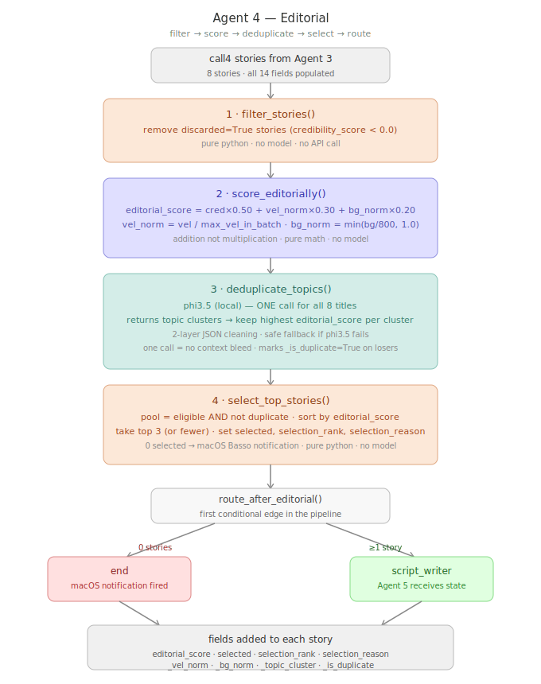
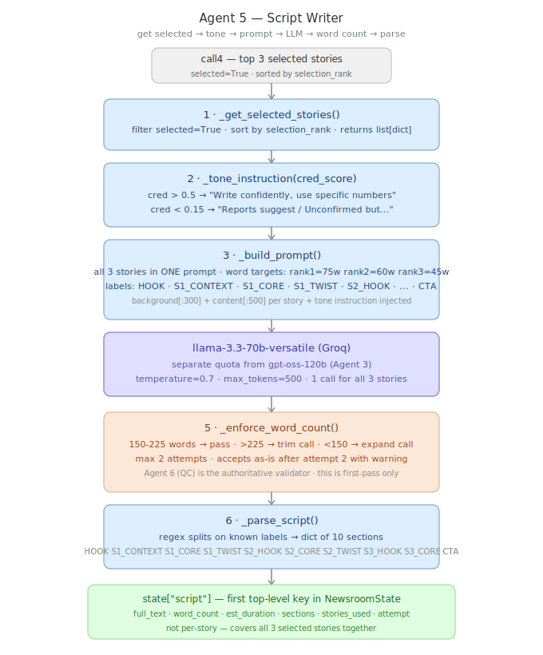
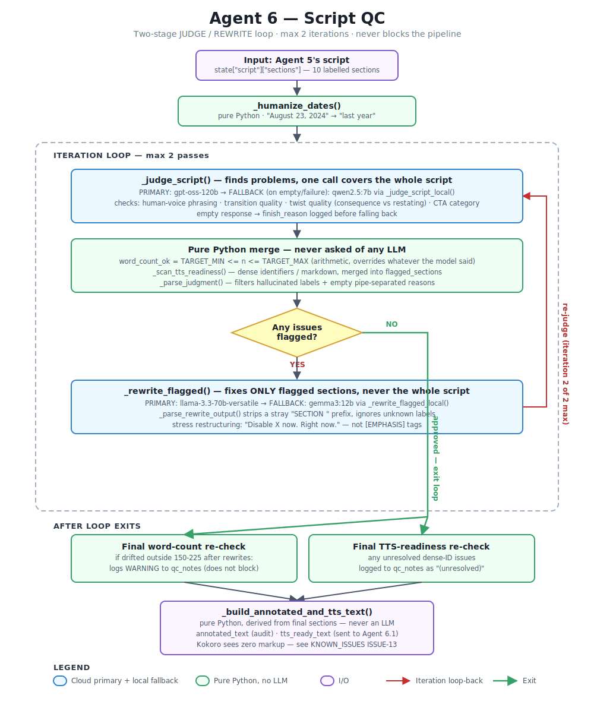
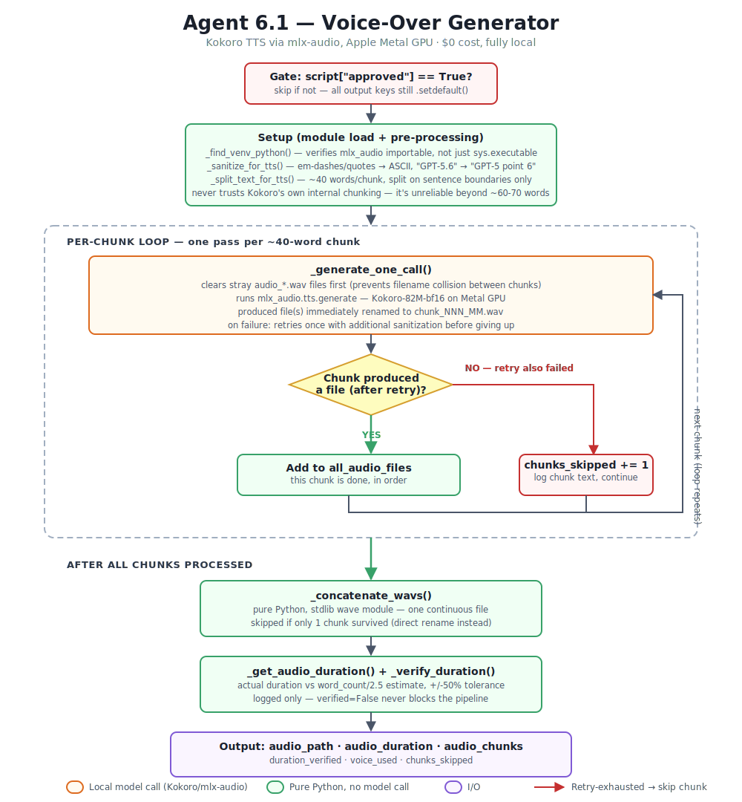
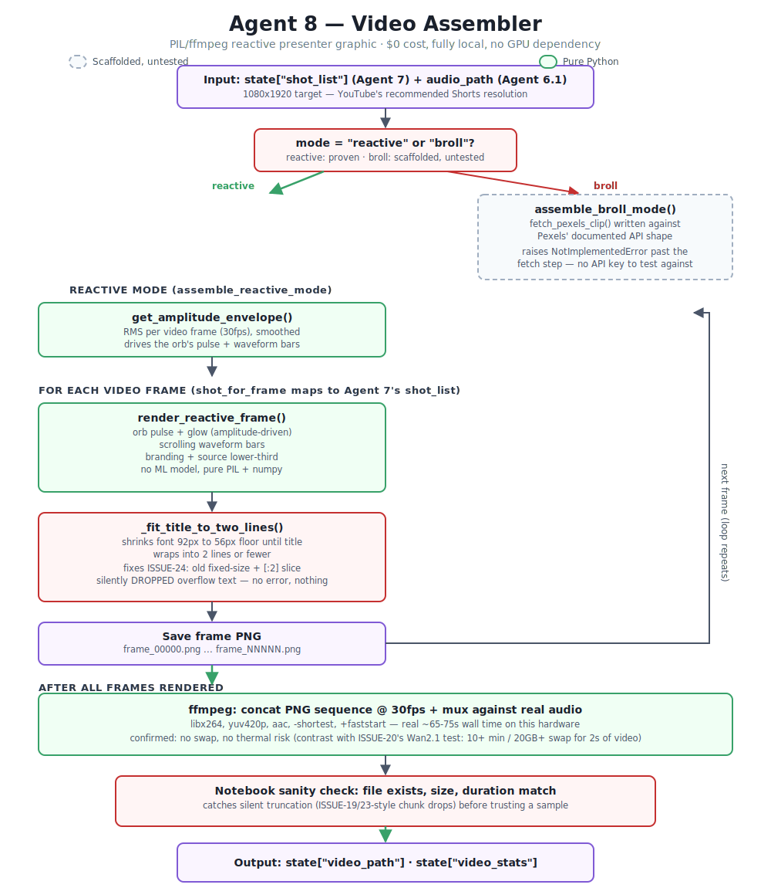

# Agent Architecture -- Detailed Reference

Full technical breakdown of every agent's internal design: functions, formulas,
prompt engineering decisions, and real failure modes encountered during
development. The [main README](../README.md) has the high-level summary --
this document is the deep-dive for each agent.

**Contents:** [Agent 2](#agent-2--context-researcher-detailed) - [Agent 3](#agent-3--fact-checker-detailed) - [Agent 4](#agent-4--editorial-detailed) - [Agent 5](#agent-5--script-writer-detailed) - [Agent 6](#agent-6--script-qc-detailed) - [Agent 6.1](#agent-61--voice-over-generator-detailed)

Agent 1 (Trend Hunter) has no dedicated section here -- its entire logic is
one velocity formula, documented fully in the main README's pipeline diagram.

---

### Agent 2 -- Context Researcher (detailed)

Agent 2 is the most complex agent built so far. It runs three internal stages for every story.


```
STAGE 1 -- Content Fetch (3-tier fallback)
  trafilatura -> Jina AI reader -> Tavily extract
  Each tier gated by looks_like_real_content():
    length check (>=200 chars)
    whitespace ratio check
    junk markers (Cloudflare, Akamai, captcha...)
    prose-line check (menus vs articles)

STAGE 2 -- Background Gather
  DDG news search (up to 5 snippets, 2s rate-limit sleep)
  + Wikipedia summary (phi3.5 extracts keyword -> 12 sentences)
  -> combined snippets list

STAGE 3 -- Synthesis (intent-based routing)
  0 snippets + small payload  -> groq/compound-mini (web search built-in)
                                  -> gpt-oss-20b (big-boss escalation)
  rich snippets OR large payload -> llama3.1:8b local (no size limit)
  Either path -> _clean_synthesis() -> _strip_citation_artifacts() -> story["background"]
```

**Citation-artifact stripping (added after a real run):** the `gpt-oss-20b`
big-boss escalation path emits internal web-search citation markers like
`\u3010 2\u2020L10-L12 \u3011` directly into its output text -- never meant to reach
end-user content. `_strip_citation_artifacts()` runs inside
`fetch_trend_background()` (the single wrapper all three synthesis paths
funnel through), so the fix catches artifacts regardless of which tier
produced the result. See KNOWN_ISSUES ISSUE-14.

### Agent 3 -- Fact Checker (detailed)


Agent 3 v2 scores credibility on a **-1 to +1 scale**. Zero is the natural boundary -- negative = discard, positive = keep.

**Three signals with dynamic reweighting:**

| Signal | Base Weight | Range | How |
|--------|-------------|-------|-----|
| `source_score` | 20% | 0.0 to +0.95 | 35-domain trust map (HN-tuned) |
| `llm_credibility_check` | 60% | -0.7 to +0.9 | gpt-oss-120b -> REAL/OPINION/SPAM |
| `cross_verify` | 20% | -0.6 to +0.8 | Exa semantic search -> DDG fallback |

**Label scores:** REAL -> +0.9 - OPINION -> +0.1 - SPAM -> -0.7

**Dynamic reweighting** -- shifts when cross_verify fires:
- Contradiction detected: llm 60%->30%, verify 20%->50% (contradiction amplified)
- Confirmation detected:  llm 60%->50%, verify 20%->30% (verify boosted)
- Neutral (not found):    standard weights unchanged

**Guards:**
- content < 100 chars -> 0.0 neutral (can't verify)
- content < 500 chars -> 0.0 neutral (too thin to judge)
- Groq failure / empty response -> tries local qwen2.5:7b fallback before
  giving up (see below) -> 0.0 neutral only if BOTH fail (never discard
  on any failure)

**Local fallback -- qwen2.5:7b (added after a real production gap):**
`llm_credibility_check()` originally had NO fallback at all -- any Groq
failure silently returned 0.0 neutral immediately. During a real Groq
outage this meant EVERY story lost its credibility signal for that run,
leaving Agent 4 selection driven by velocity alone. A local qwen2.5:7b
fallback was added and validated via a multi-run reliability test
(`test_agent3_credibility_reliability.py`): **15/15 runs across 3 real
stories** -- a clean tech tutorial, an opinion piece, and a security
vulnerability disclosure (a deliberate stress test for whether a safety
filter might suppress classification of that content) -- 100% consistent,
100% correct classification. A shared `_parse_credibility_label()` helper
parses both the cloud and local model's output identically.

**Cross-verification:**
- Exa semantic search (primary) -- finds story variants, HN-aware indexing
- DDG news fallback -- already in pipeline, free, real-time
- Only sources with trust >= 0.70 can trigger verification signals
- Contradiction check uses compound-mini (separate quota from 120b)

**Quota isolation (three separate Groq pools):**
- gpt-oss-120b: credibility classification (200K tokens/day)
- gpt-oss-20b:  Agent 2 big-boss synthesis (200K tokens/day)
- compound-mini: contradiction check (own TPM pool)

```python
combined = round(src*w_src + llm*w_llm + verify*w_verify, 2)
score < 0.0 -> story["discarded"] = True  (marked, NOT deleted -- audit trail)
```

### Agent 4 -- Editorial (detailed)



Agent 4 answers "which stories should we actually cover today?" -- filtering, scoring, deduplicating, and selecting the top 3 from Agent 3's credibility-scored pool.

**Four-step pipeline (pure Python except deduplication):**

| Step | Function | What |
|------|----------|------|
| 1 | `filter_stories()` | Remove `discarded=True` stories (no model, no API) |
| 2 | `score_editorially()` | Composite score, addition not multiplication |
| 3 | `deduplicate_topics()` | qwen2.5:7b clusters titles by topic (one call) |
| 4 | `select_top_stories()` | Sort by editorial_score, take top 3 |

**Editorial score formula (weighted addition, not multiplication):**

```python
vel_norm = min(velocity / max_velocity_in_batch, 1.0)   # relative to today's batch
bg_norm  = min(len(background) / 800, 1.0)               # 0-1, capped at 800 chars

editorial_score = credibility_score*0.50 + vel_norm*0.30 + bg_norm*0.20
```

Why addition, not multiplication: a viral, credible story with a thin
background would score **zero** under multiplication (one weak signal
kills everything). Addition means each signal contributes independently --
missing background is a *penalty*, not a *veto*.

**Deduplication -- model evolution during testing:**
- phi3.5 (3.8B): correct JSON *format* issues fixed with 2-layer cleaning
  (trailing commas, spaces in brackets, text mixed with numbers) --
  but still clustered *unrelated* stories together (e.g. grouped a NAS
  tutorial with a TTS tool as "both local software")
- **qwen2.5:7b** (current, no cloud primary needed): better semantic topic
  separation, same 2-layer JSON safety net retained. Confirmed via a
  multi-run reliability test (`test_dedup_reliability.py`): **5/5 runs
  100% identical clustering** on real data. A separate head-to-head
  test against gpt-oss-120b (the "obvious" stronger cloud model) found
  qwen2.5:7b's clustering was actually MORE correct -- gpt-oss-120b grouped
  three genuinely unrelated stories (a TTS tool, a router CVE, and a 1986
  CS lecture series) into one cluster, which would have silently dropped
  a strong security story from the final selection. See KNOWN_ISSUES
  ISSUE-9.

**Topic clusters -> keep highest editorial_score per cluster:**
```python
# qwen2.5:7b returns: [[1,3],[2],[4],[5],[6],[7],[8]]
# story 1 and 3 are "same topic" -> keep whichever scores higher
# story marked _is_duplicate=True is excluded from selection, NOT deleted
```

**LangGraph conditional edge (first branching point in the pipeline):**
```python
def route_after_editorial(state) -> str:
    selected = [s for s in state["stories"].values() if s.get("selected")]
    if len(selected) >= 1:
        return "script_writer"   # even ONE great story is worth covering
    return "end"                  # 0 stories -> macOS notification, pipeline stops
```
Real newsroom logic: a fixed quota of 3 is wrong. Quality over quantity --
one credible, high-velocity story beats padding to reach a number.

**Fields added per story:**
```
editorial_score - selected - selection_rank - selection_reason
_vel_norm - _bg_norm - _topic_cluster - _is_duplicate
```

### Agent 5 -- Script Writer (detailed)



Agent 5 turns the top 3 selected stories into ONE continuous 60-90 second
YouTube Shorts script, using `llama-3.3-70b-versatile` -- a separate Groq
quota pool from Agent 3's `gpt-oss-120b`.

**Seven-function pipeline (the sixth is a fallback, not part of the
main line, but sits at the exact point where Agent 5's only real
production gap was found):**

| Function | Job |
|----------|-----|
| `_get_selected_stories()` | Filter `selected=True`, sort by `selection_rank` |
| `_tone_instruction()` | Map `credibility_score` -> confident / attributed / cautious |
| `_build_prompt()` | Assemble one prompt covering all 3 stories |
| (LLM call) | `llama-3.3-70b-versatile`, temperature=0.4, one call |
| `_enforce_word_count()` | Trim/expand if outside 150-225 words, max 2 attempts |
| `_generate_script_local()` | Local fallback -- `gemma3:12b` via Ollama |
| `_parse_script()` | Regex-extract 10 labelled sections |

**Tone calibration -- driven entirely by Agent 3's credibility_score:**
```
cred > 0.5   -> "Write confidently. State facts directly. Use specific numbers."
cred > 0.15  -> "Attribute clearly: 'According to the report', 'The company says'"
cred < 0.15  -> "Cautious framing: 'Reports suggest', 'If accurate, this means'"
```

**Section labels (word budget: rank1=90w, rank2=70w, rank3=55w ~ 215w total):**
```
HOOK -> S1_CONTEXT -> S1_CORE -> S1_TWIST ->
S2_HOOK -> S2_CORE -> S2_TWIST ->
S3_HOOK -> S3_CORE -> CTA
```

**Prompt engineering lessons learned (iterative, real-run driven):**

| Problem observed | Fix applied |
|---|---|
| HOOK was generic ("New tech updates daily") | BAD/GOOD examples in prompt, rule: "must name ONE specific fact" |
| TWIST just restated CORE | Explicit rule: "must reveal a consequence NOT already stated" |
| Model reordered stories for drama | `temperature 0.7->0.4` + explicit "write in exact order given" |
| CTA became a custom 30-word paragraph | "WORD-FOR-WORD, copy one of three exact sentences, no label/letter prefix" |
| Transitions were flat ("Meanwhile...") | Two-part rule: signal completion, then open next story with tension |
| AI press-release voice ("can generate high-quality speech") | Banned-phrases list + "write like a friend explaining over coffee" |
| First draft undershot word count (105w) | Word-count enforcement with trim/expand, max 2 attempts |
| Expand attempt overshot badly (105w->387w) | Explicit ceiling: "target X words exactly, not just 'at least'" |
| Model sometimes wrote an unrequested S3_TWIST | `_parse_script()` merges any stray S3_TWIST content into S3_CORE instead of dropping it |
| A real Groq outage produced 0 words, cascading into Agent 6 having nothing to QC | `_generate_script_local()` -- gemma3:12b fallback, validated via 4-model A/B test |

**Local fallback -- gemma3:12b (added after a real production failure):**
The main generation call had zero local fallback until a real Groq outage
during testing produced 0 words. `gemma3:12b` was selected via a real A/B
test against `qwen3:8b`, `llama3.1:8b`, and `gemma2:9b` on this project's
actual pipeline data (`test_agent5_generation_models.py`): best factual
retention, best TWIST quality, and -- critically -- the only local
candidate that did NOT bleed the prompt's own TWIST example sentence into
the wrong story's section (`qwen3:8b` and `llama3.1:8b` both did this
independently on the same real test).

**Word count enforcement -- never blocks the pipeline:**
```python
150-225 words        -> pass through immediately
> 225 words          -> one trim call -> re-check
< 150 words          -> one expand call -> re-check
still wrong after 2   -> accept as-is with warning (Agent 6 QC catches it)
```

**Output -- first top-level key in NewsroomState (not per-story):**
```python
state["script"] = {
    "full_text":    str,   # complete script
    "word_count":   int,   # verified count
    "est_duration": str,   # e.g. "78s"
    "sections":     dict,  # 10 labelled sections
    "stories_used": list,  # [1, 2, 3] selection ranks
    "attempt":      int,   # 1 or 2 (audit trail)
}
```

**Design boundary -- Agent 5 vs Agent 6:**
Agent 5 owns *what* to say (facts, structure, word count). Human-voice
polish, date humanization ("August 23, 2024" -> "last year"), and pacing
annotations (`[PAUSE]` `[BEAT]` `[EMPHASIS]`) are explicitly deferred to
Agent 6 -- Agent 5 doesn't know today's date, Agent 6 will.

---

### Agent 6 -- Script QC (detailed)



Agent 6 validates and polishes Agent 5's script until it is genuinely
ready for voice-over generation -- fixing format violations surgically
and adding the human voice Agent 5 was never asked to have. It never
rewrites the whole script; it only touches sections a JUDGE stage
actually flagged.

**Two-stage model split, mirroring Agent 3's source/LLM design:**

| Stage | Primary | Fallback | Job |
|---|---|---|---|
| JUDGE | `openai/gpt-oss-120b` | `qwen2.5:7b` | Reasoning-tuned, finds problems across the whole script in one call |
| REWRITE | `llama-3.3-70b-versatile` | `gemma3:12b`* | Creative fluency, fixes ONLY what was flagged |

*\* The `REWRITE_FALLBACK_MODEL` constant currently reads `gemma3:12b`.
An earlier A/B test (`test_rewrite_fallback_models.py`) had selected
`gemma2:9b` for this role (100% format compliance vs qwen2.5:7b's 0%,
and safer on facts). A later test script
(`test_rewrite_gemma3_check.py`) was written specifically to check
whether `gemma3:12b` beats `gemma2:9b` on this exact task -- if that
test confirmed `gemma3:12b` as the winner, this is the correct current
value. If not, note that `agent6.py`'s `_rewrite_flagged_local()`
docstring still says `"gemma2:9b via Ollama"` -- that comment is stale
either way and should be updated to match whichever model the constant
actually points to.*

**Ten-function pipeline:**

| Function | Job |
|---|---|
| `_humanize_dates()` | Pure Python, datetime delta -- never asked of an LLM |
| `_scan_tts_readiness()` | Pure Python regex -- flags dense identifiers/markdown per section |
| `_judge_script()` | Stage 1 orchestration -- builds prompt, calls JUDGE + fallback, merges in Python-computed word count and TTS-readiness |
| `_judge_script_local()` | JUDGE fallback call (qwen2.5:7b) |
| `_parse_judgment()` | Parses JUDGE's structured text response, filters hallucinated labels and empty reasons |
| `_default_judgment_pass()` | Safe all-pass fallback when both JUDGE attempts fail |
| `_rewrite_flagged()` | Stage 2 orchestration -- builds targeted per-section fix instructions, calls REWRITE + fallback |
| `_parse_rewrite_output()` | Parses REWRITE's `LABEL: text` output, tolerates a stray `"SECTION "` prefix |
| `_rewrite_flagged_local()` | REWRITE fallback call |
| `_build_annotated_and_tts_text()` | Pure Python -- derives both text outputs deterministically, no LLM |
| `script_qc_node()` | LangGraph node, orchestrates everything, max 2 iterations |

**Why word count and TTS-readiness are pure Python, never asked of an
LLM:** both are deterministic, checkable facts. A real multi-run test
showed a local fallback model giving WRONG answers to "is 165 within
150-225?" -- a question that never should have been asked of any LLM,
cloud or local, in the first place. `_judge_script()` computes
`word_count_ok` via plain arithmetic and OVERRIDES whatever (if
anything) the model said; `_scan_tts_readiness()` runs a regex scan and
merges its findings directly into `flagged_sections` so the same
REWRITE call that fixes human-voice issues also fixes dense
identifiers -- not a separate advisory-only log line.

**JUDGE prompt -- structured response format:**
```
FLAGGED_SECTIONS: <comma-separated labels from the valid list, or NONE>
FLAGGED_REASONS: <one reason per flagged section, separated by |>
CTA_CATEGORY: A or B or C or INVALID
CTA_OK: YES or NO
```
Checks: human-voice (AI-press-release phrasing), transition quality
(S2/S3_HOOK signal completion + open with tension), twist quality
(consequence vs restating CORE), and CTA category/format.

**REWRITE prompt -- targeted, never whole-script:**
Only flagged sections are included in the prompt, each with its own
specific instruction derived from the JUDGE's reason. Any section
containing a strong directive (e.g. "no patch exists") is instructed
to end with the key action as its own short sentence, so it lands with
natural vocal stress when spoken -- this is how emphasis is achieved
without markup (see below).

**Real bugs found and fixed (all from actual pipeline runs, not
anticipated in advance):**

| Bug | Root cause | Fix |
|---|---|---|
| JUDGE silently "approved" a script with zero real checking | Empty `raw` response fell through `_parse_judgment`'s defaults, which read as all-clean | Explicit empty-check before parsing; falls back to local model first, only defaults to all-pass if BOTH fail |
| No visibility into WHY JUDGE went empty | `finish_reason` was never logged on the live path, only in throwaway test scripts | Logs `finish_reason` directly whenever `raw` comes back empty |
| REWRITE actually made a script worse | `"FLAGGED_REASONS: \|"` (bare pipe) split into `['','']` -- two EMPTY STRINGS parsed as valid reasons instead of falling back to a default, so REWRITE got zero real instruction for 2 of 3 sections and added filler phrasing instead of fixing anything | `reasons = [r.strip() for r in reasons_raw.split("\|") if r.strip()]` -- filters empties before indexing |
| Rewrite silently dropped for an entire iteration | `llama-3.3-70b-versatile` wrote `"SECTION S2_CORE:"` instead of `"S2_CORE:"`, despite explicit instructions not to | `_parse_rewrite_output()` strips a leading `"SECTION "` prefix before matching against real section keys |
| A local model hallucinated a section label that was never in its input | `qwen2.5:7b`, given only the real section list, still invented `"S3_TWIST"` from pattern-matching typical script structures | `_parse_judgment()` filters any `FLAGGED_SECTIONS` entry not in the actual `valid_labels` list, regardless of which model produced it |
| Final script shipped 1 word over the target range with no warning | Two rewrite iterations (triggered by the blank-reasons bug above) pushed word count from 202 to 226 without any re-check after the last iteration | Explicit re-check of `final_word_count` after the loop, appends a `WARNING:` note to `qc_notes` if still out of range (never blocks) |

**Kokoro markup limitation -- annotated_text vs tts_ready_text:**
Kokoro has no native support for `[PAUSE]`/`[BEAT]`/`[EMPHASIS]` tags --
sending them directly would produce Kokoro reading the bracket
characters literally (see KNOWN_ISSUES ISSUE-13). `_build_annotated_and_tts_text()`
resolves this by DERIVING `annotated_text` deterministically from the
final approved sections (detecting section boundaries for `[BEAT]` and
short trailing clauses for `[EMPHASIS]`), never generating it via an
LLM and never sending it to Kokoro. `tts_ready_text` is the plain,
punctuation-only concatenation actually passed to Agent 6.1.

**Output -- new keys added to state["script"]:**
```python
state["script"]["approved"]        bool
state["script"]["qc_notes"]        list[str]   audit trail, including
                                                any unresolved-issue or
                                                word-count-drift warnings
state["script"]["annotated_text"]  str         has [BEAT]/[EMPHASIS] markers
state["script"]["tts_ready_text"]  str         clean, sent to Agent 6.1
state["script"]["cta_category"]    str         "A" / "B" / "C"
state["script"]["iterations"]      int         1 or 2
```

**Design boundary -- what Agent 6 does NOT do:**
Does not call Kokoro or generate audio (Agent 6.1's job). Does not
re-select stories (Agent 4's job). Does not regenerate the whole script
from scratch -- only ever touches flagged sections. Does not change
locked facts (CVE IDs, model specs, numbers). Does not touch story
order (Agent 5 already enforces this).

---

### Agent 6.1 -- Voice-Over Generator (detailed)



Agent 6.1 was **not in the original 10-agent roadmap** -- it was added
after Agent 1 itself surfaced an HN story about Kokoro, a small local
text-to-speech model, which Agent 3 then confirmed and Agent 4 selected
for scripting (see KNOWN_ISSUES ISSUE-12 for the full story). It
converts Agent 6's QC'd `tts_ready_text` into actual voice-over audio
using Kokoro via `mlx-audio`, running entirely on Apple Metal GPU --
$0 cost, no API key, no network dependency after the one-time model
download.

**Nine-function pipeline:**

| Function | Job |
|---|---|
| `_find_venv_python()` | Resolves the correct Python interpreter at module load time -- `sys.executable` alone is unreliable when Jupyter spawns subprocesses |
| `_split_text_for_tts()` | Pure Python, splits into ~40-word TTS-safe chunks by sentence boundary |
| `_sanitize_for_tts()` | Replaces characters that cause Kokoro's phonemizer to fail silently |
| `_generate_one_call()` | Clears stray files, runs `mlx_audio.tts.generate` for ONE chunk, renames output to a unique name |
| `_generate_audio()` | Orchestrates chunking, sanitizing, per-chunk generation with retry-then-skip, and final concatenation |
| `_concatenate_wavs()` | Pure Python WAV concatenation via the stdlib `wave` module |
| `_get_audio_duration()` | Reads actual final `.wav` duration |
| `_verify_duration()` | Sanity-checks duration against the word-count estimate |
| `voice_over_node()` | LangGraph node -- always sets every state key it owns, even on failure |

**Real bugs found and fixed (three, all from actual test runs, in the
order discovered):**

| Bug | Root cause | Fix |
|---|---|---|
| A ~190-word single call produced wildly inconsistent audio -- one run auto-split into 3 files (~26-28s each), another produced only 1 file (~28.5s) covering roughly one story, silently dropping the rest with exit code 0 | Kokoro/mlx-audio's own internal chunking behavior is unreliable beyond ~60-70 words per call | Pre-split text into ~40-word chunks ourselves via `_split_text_for_tts()`, before ever calling Kokoro -- never trust Kokoro's own chunking |
| Chunk 2 of 7 failed silently once pre-chunking was added -- no error, no exception, the before/after file-diff just came back empty | `mlx_audio` resets its own internal file counter (`audio_000.wav`) on every fresh subprocess invocation; chunk 1's leftover output file was still present when chunk 2 ran, so chunk 2 silently overwrote it under the same name | Clear any stray `audio_*.wav` files BEFORE each chunk call; immediately rename the result to a unique `chunk_NNN_MM.wav` right after |
| Chunk 5 of 8 (23 words, well under the 40-word limit) caused `mlx_audio` to exit 0 with no output file and no error message | Kokoro's phonemizer crashes on certain content: Unicode typographic characters (em dashes, smart quotes) AND decimal-separated version numbers like `"GPT-5.6"` -- confirmed via direct reproduction: `"GPT-5.6 is a new model."` throws a `broadcast_shapes` ValueError deep inside `istftnet.py` (an F0-tensor shape mismatch), caught internally, no file written | `_sanitize_for_tts()`: replaces em-dashes/smart-quotes/ellipses with ASCII equivalents, and converts `X.Y` decimal patterns to spoken form (`"GPT-5.6"` -> `"GPT-5 point 6"`) in a repeating pass (handles chained versions like `"v1.2.0"`); retries once after sanitizing; if still failing, SKIPS the chunk rather than aborting the whole pipeline -- partial audio beats no audio |
| The subprocess call intermittently invoked the wrong Python interpreter (system Python without `mlx_audio` installed) rather than the active venv's Python | `sys.executable` inside a Jupyter-spawned subprocess does not reliably resolve to the active venv | `_find_venv_python()` runs once at module load, checks several candidate paths (relative to the agents directory, `$VIRTUAL_ENV`, then `sys.executable` as last resort), verifying each candidate actually has `mlx_audio` importable before accepting it |
| **(open, not yet fixed)** A real 201-word/7-chunk run's final chunk -- 8 words, containing the CTA -- exited cleanly with no output file. **Recurred on a second real run** (2026-07-14, 260-word/9-chunk script): this time chunks 8 AND 9 (26 words each) both dropped, again the last two chunks in the script, again losing the CTA | Not yet confirmed, but now supported by two independent data points rather than one: both failures were short chunks (8 and 26 words) positioned at or near the very end of the script. Text in both cases contained none of the known Bug-3 trigger characters, so that fix doesn't apply here. Suspected but unconfirmed cause is `mlx_audio`/Kokoro struggling with short isolated chunks specifically -- still not reproduced in a standalone/isolated test | None yet -- retry-then-skip correctly prevented a total pipeline failure both times, but silently shipped audio missing its CTA on both real runs. See [KNOWN_ISSUES ISSUE-19](../KNOWN_ISSUES.md#issue-19-agent-61----short-final-chunk-silently-dropped-by-mlx_audio-cta-lost) and [ISSUE-23](../KNOWN_ISSUES.md#issue-23-agent-61-chunk-drop-issue-19-recurred-dropping-2-chunks-instead-of-1) for the full history and candidate fixes under consideration |

**Why the fix is retry-then-SKIP, not retry-then-abort:**
A script covering 3 stories that loses one chunk to an unfixable content
issue still has the other ~90% of its audio. Aborting the whole
pipeline over one bad sentence throws away far more good audio than it
protects. `chunks_skipped` is tracked and surfaced in the output so the
gap is visible, not silent.

**Output -- new keys added to state["script"], ALWAYS present even on
failure (defaults shown):**
```python
state["script"]["audio_path"]        str | None   default None
state["script"]["audio_duration"]    float        default 0.0
state["script"]["audio_generated"]   bool         default False
state["script"]["duration_verified"] bool         default False
state["script"]["voice_used"]        str          default DEFAULT_VOICE
state["script"]["audio_chunks"]      int          default 0
state["script"]["chunks_skipped"]    int          default 0
```
Every key is set via `.setdefault()` at the very top of `voice_over_node()`,
before any code path can fail -- downstream code (or a notebook print
statement) can never hit a `KeyError` regardless of what happened during
generation.

**Design boundary -- what Agent 6.1 does NOT do:**
Does not rewrite or QC text (Agent 6's job -- text arrives pre-approved).
Does not add pause/emphasis markup (Kokoro can't render it; pacing is
already baked into `tts_ready_text`'s punctuation and sentence structure
by Agent 6). Does not decide video scene timing (a future agent's job,
though it will consume this agent's `audio_duration` output). Does not
run at all if Agent 6 has not approved the script.

---

### Agent 7 -- Video Assembly Prompt (implemented, tested)


**Status:** Complete. Built as `experiments/agents/agent7.py`, wired
into `workflow.ipynb` (`till-agent7` checkpoint), tested against real
pipeline data (the 2026-07-13 Beavis Ultrasound / Cyberpunk Comics /
Tiny Emulators run).

**Role:** convert each script section into a concrete, searchable
stock-footage query and a timing window -- not a cinematic AI-video
prompt (see README's
[Why stock footage, not AI video generation?](../README.md#why-stock-footage-not-ai-video-generation)
for why the project pivoted away from generated video entirely; the
later real hardware test in KNOWN_ISSUES ISSUE-20 confirmed that
pivot was the right call, not just a cost-saving guess).

**Inputs actually used** (confirmed via real testing, not assumed):
- `state["stories"]` -- dict/list of selected stories, each with
  `title`, `url`, `content`, `selection_rank`
- `state["script"]["sections"]` -- the 10 labeled HOOK/S1_CONTEXT/.../CTA
  sections; query + timing are computed **per section**, not per story,
  for finer-grained footage variety than one query per 3-sentence story
- `state["script"]["word_count"]` and (once available)
  `state["script"]["audio_duration"]`

**Design questions from earlier, now resolved:**
- **One query per story or per section?** -> Per section. Implemented
  as the primary granularity; each of the 10 sections gets its own
  query and timing window.
- **How literal should queries be?** -> LLM-extracted via `qwen2.5:7b`
  with strict output validation (2-8 words, rejects instruction-echo),
  falling back to one of 5 keyword-sniffed categories
  (security/hardware/software/research/generic_tech) if extraction
  fails, is malformed, or Ollama is unavailable -- never lets a
  video-prompt failure take down the whole pipeline run.
- **Local model or no LLM at all?** -> Local model (`qwen2.5:7b`),
  matching the project's local-first pattern, but deliberately *not*
  the larger models reserved for heavier reasoning tasks (Agent 2
  synthesis, Agent 5 script writing) -- this is a small, structured,
  low-creativity extraction task that doesn't need that capacity.

**Section-to-story mapping:** `S1_*`/`S2_*`/`S3_*` prefix maps directly
to `selection_rank` 1/2/3 via regex; `HOOK`/`CTA` are treated as
whole-video bookends with a generic branded query and no single
story's source domain attached.

**Timing:** word-count-proportional against `audio_duration` (an
explicit approximation, not frame-accurate -- see the `beat_timestamps`
dependency note below, still open).

**Two defensive checks added after real bugs surfaced during testing,**
both worth keeping in any future refactor:
1. Raises `ValueError` if a section references a `story_rank` not
   present in `state["stories"]` -- caught a real test-data
   inconsistency during development, not hypothetical.
2. Raises `ValueError` if `state["script"]["word_count"]` doesn't equal
   the actual sum of each section's word count -- guards directly
   against the exact class of drift ISSUE-18 already documented for
   Agent 6's rewrite loop. Also caught a real bug during Agent 7's own
   testing (hand-reconstructed test data had a stale word count),
   confirming this check earns its place rather than being defensive
   programming for its own sake.

**Real bug found on an actual pipeline run (ISSUE-22, fixed):**
Agent 7 crashed outright with `KeyError: 'selection_rank'` on a real
second run (2026-07-14). Root cause: `state["stories"]` holds every
story seen that run (6-8 typically), not just the 3 ultimately
selected. The original code assumed every story dict had a
`selection_rank` key. That's false for a story Agent 3 discarded
(contradicted/low credibility) -- a discarded story never reaches
Agent 4's editorial scoring at all, so it has no `selection_rank` key
whatsoever, not `None`, genuinely absent. The first run that day
happened to have zero Agent-3 discards, so this bug existed from
Agent 7's first version but wasn't triggered until a run with a
genuine discard occurred. Fixed by filtering on key presence before
access (`"selection_rank" in s and s.get("selection_rank") is not
None`) rather than assuming uniform shape across every entry in
`state["stories"]`. See
[KNOWN_ISSUES ISSUE-22](../KNOWN_ISSUES.md#issue-22-agent-7-build_shot_list-crashed-with-keyerror-selection_rank-on-any-run-with-an-agent-3-discarded-story)
for the full writeup, including the lesson that `state["stories"]` is
best understood as "every story this run ever looked at, at any
stage," not "the 3 selected stories" -- worth grep'ing other
downstream code for similar unguarded key access into that dict.

**Known constraint from Agent 6.1:** exact per-chunk/per-section timing
(`beat_timestamps`) is not yet tracked -- flagged as a Phase 6.2
dependency in the README roadmap, but it's actually a dependency for
precise Agent 7/8 clip-timing too, not just sound design. Worth
revisiting whether that timing work should be pulled forward rather
than treated as Phase 6.2-only.

---

### Agent 8 -- Video Assembler (`reactive` mode implemented and tested; `broll` mode scaffolded, not tested)



**Status:** `reactive` mode complete, tested end-to-end against real
pipeline audio (the 2026-07-13 run, 83s) and wired into
`workflow.ipynb` (`till-agent8` checkpoint). `broll` mode is written
but explicitly unverified -- see below.

**Role:** consume Agent 7's `shot_list` + Agent 6.1's stitched audio,
produce the final MP4 at 1080x1920 (YouTube's *recommended* Shorts
resolution, not just the 720x1280 minimum an earlier prototype used).

**`reactive` mode (proven):** pure PIL + numpy, no ML model, no GPU
dependency --
- Audio amplitude envelope (RMS per video frame, smoothed) drives a
  pulsing/glowing abstract "anchor" orb and a scrolling waveform-bar
  indicator. Deliberately not a face -- sidesteps the uncanny-valley
  risk of a bad lip-sync entirely (see KNOWN_ISSUES ISSUE-20 for why
  an actual AI avatar was evaluated and ruled out on this hardware).
- Source-citation lower-thirds (story title + domain) fade in per
  section using Agent 7's real per-section timing, not a cruder
  per-story approximation.
- Real measured cost on this project's actual M4 Pro: ~2 minutes
  render time for a full ~83s video, negligible memory/thermal
  footprint -- a deliberate contrast with the AI-video-generation path
  (10+ minutes and 20GB+ swap for 2 *seconds* of unusable output, per
  ISSUE-20's real hardware test).

**`broll` mode (scaffolded, NOT verified):** `fetch_pexels_clip()` is
written against Pexels' documented video search endpoint shape, but
**no `PEXELS_API_KEY` was available during development to actually
test it**. `assemble_broll_mode()` deliberately raises
`NotImplementedError` past the fetch step rather than write
untestable ffmpeg assembly logic against an unverified fetch --
finish wiring this only after `fetch_pexels_clip()` is confirmed
working against a real key, copying the working ffmpeg
concat/mux pattern from `assemble_reactive_mode()` rather than writing
it from scratch.

**Real bug found and fixed during development -- ISSUE-21, worth
knowing about for any future rendering work in this project:**
`_load_font()`'s original version only checked a Linux font path
(`/usr/share/fonts/truetype/dejavu/...`). On the actual target machine
(macOS), that path doesn't exist, so every call silently fell through
to `ImageFont.load_default()` -- PIL's fallback bitmap font, which
**ignores the requested size entirely**. This produced unreadably
small text no matter how large a size was requested, across five
separate iterations, because the size parameter was never actually
being used on the real target machine -- only in the Linux dev sandbox
where each iteration was mistakenly "confirmed" working. Fixed by
checking real macOS font paths first and, critically, **raising
`RuntimeError` instead of silently degrading** if no real font is
found anywhere -- a crashed render with a clear message beats a
silently-wrong one. Confirmed fixed via objective pixel measurement
(numpy: measured rendered text height went from 9px/0.47% of frame
height to 126px/6.56%, matching the requested font size), not just a
second round of visual inspection -- the first bug had already
survived several rounds of "looks fine to me" checks precisely because
visual inspection of a small crop or a scaled preview can look
plausible even when the underlying value is completely wrong. See
[KNOWN_ISSUES ISSUE-21](../KNOWN_ISSUES.md#issue-21-agent-8-_load_font-silently-used-a-tiny-fallback-font-on-macos----requested-size-was-ignored-entirely)
for the full writeup.

**Second real bug found and fixed on the same feature -- ISSUE-24:**
after ISSUE-21 was fixed and font sizes were genuinely rendering, a
different problem surfaced on a real run: the lower-third title logic
capped rendering at `title_lines[:2]` after wrapping, but a longer
story title (e.g. "Climate.gov was destroyed. Open data saved it")
needed 3 lines at the fixed 92px size -- the third line was **silently
dropped**, no error, no log, nothing indicating content was lost.
Confirmed via a real screenshot and reproduced exactly in a standalone
render before fixing. Fixed with `_fit_title_to_two_lines()`: instead
of truncating, it auto-shrinks the font (92px down to a 56px floor, in
4px steps) until the title genuinely fits in 2 lines. Verified three
ways, not just visually: the exact broken title renders at 60px with
zero words dropped (checked by diffing the word set of the original
title against the wrapped lines' word set programmatically); a short
title ("Tiny Emulators") is confirmed unaffected, still rendering at
the full 92px; a medium-length title shrinks modestly (72px) as
expected. `AGENT8_VERSION` string reflects this as
`v7-title-autofit-...` or later. See
[KNOWN_ISSUES ISSUE-24](../KNOWN_ISSUES.md#issue-24-agent-8-lower-third-text-can-visually-overlapdesync-from-spoken-content-long-titles-needed-a-follow-up-fix)
for the full writeup, including a second, still-open finding from the
same issue number: the lower-third's on-screen timing can visually
mismatch what's actually being said at that moment, since Agent 7's
timing is a word-count-proportional estimate, not real
`beat_timestamps` -- see the Agent 7 section above for that same open
dependency.

**Design boundary -- what Agent 8 does NOT do:** does not select which
stories to cover or what the script says (Agents 1-6's job). Does not
decide search queries or section timing (Agent 7's job -- Agent 8
trusts `state["shot_list"]` completely). Does not currently support a
hybrid mode combining the reactive graphic with real b-roll footage in
the same video -- that compositing decision is explicitly still open
(see README's Phase 7-10 checklist).